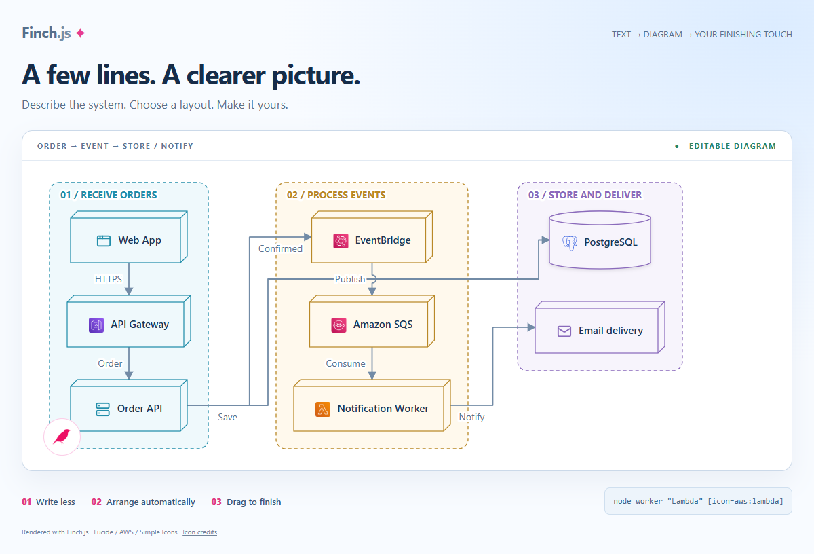
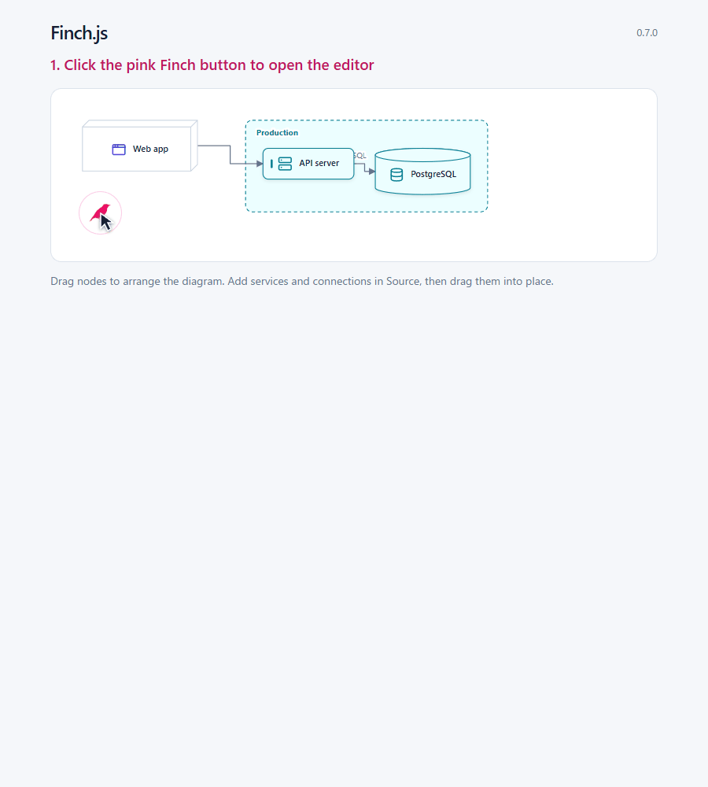
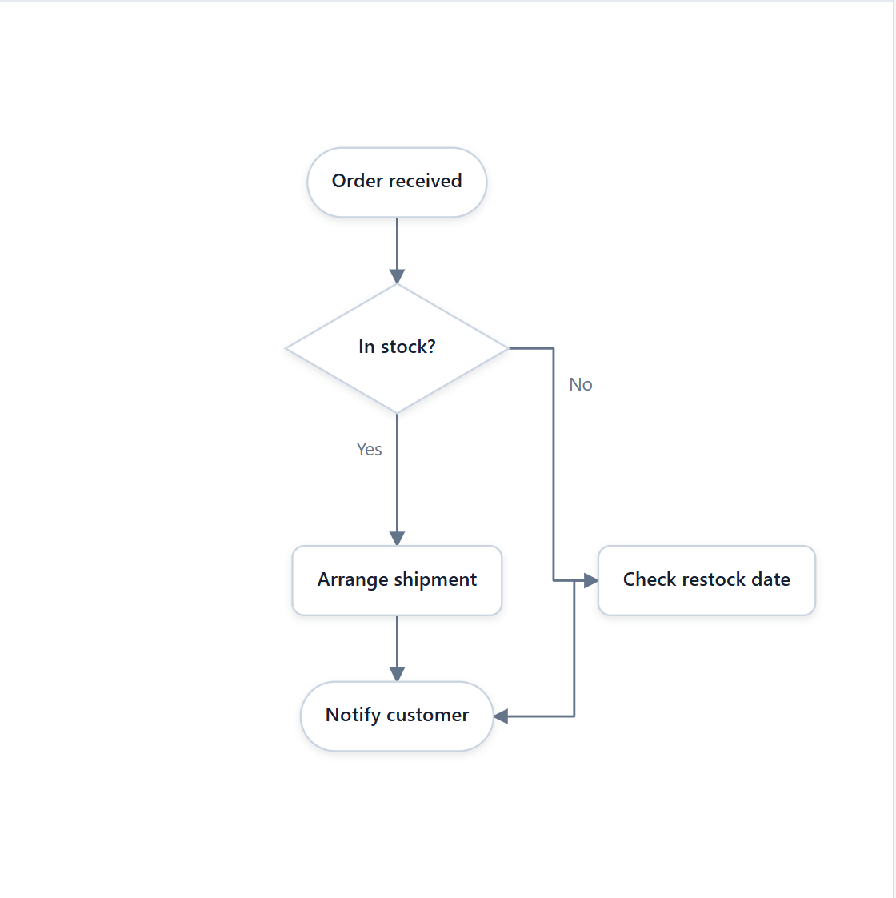
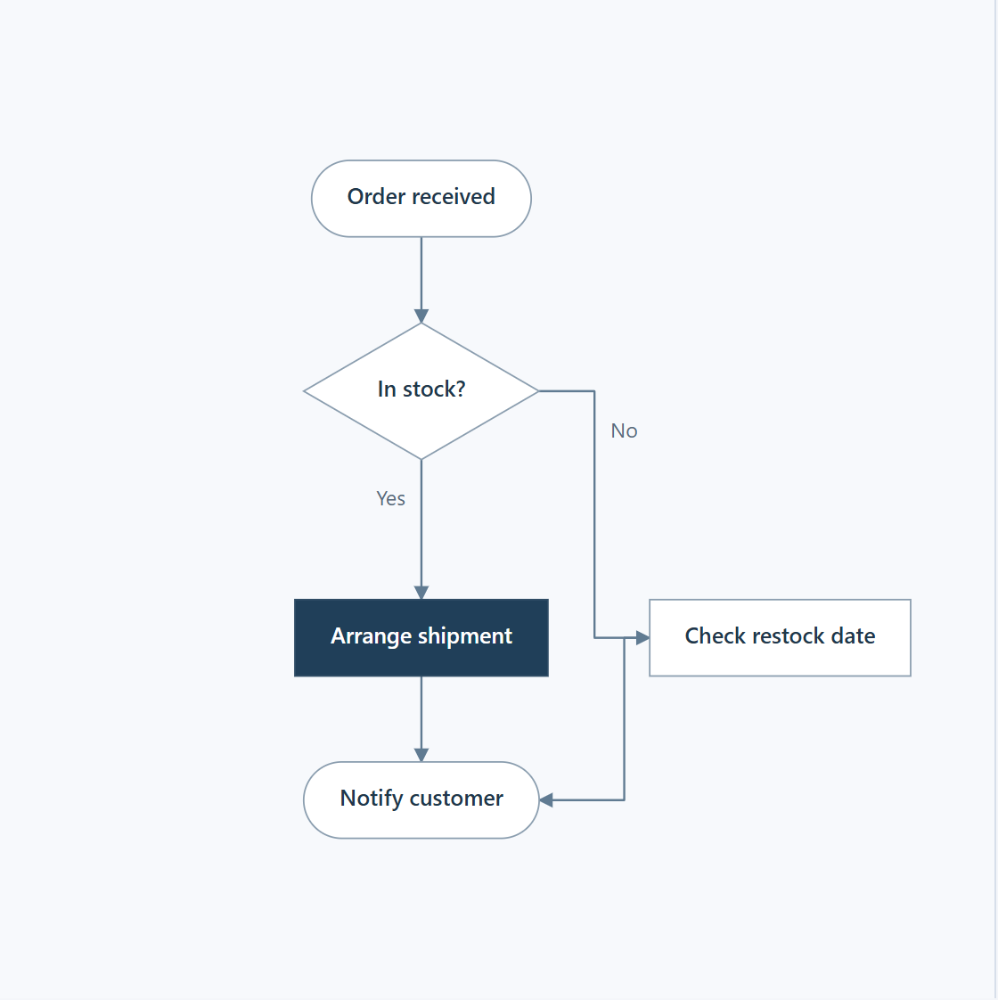
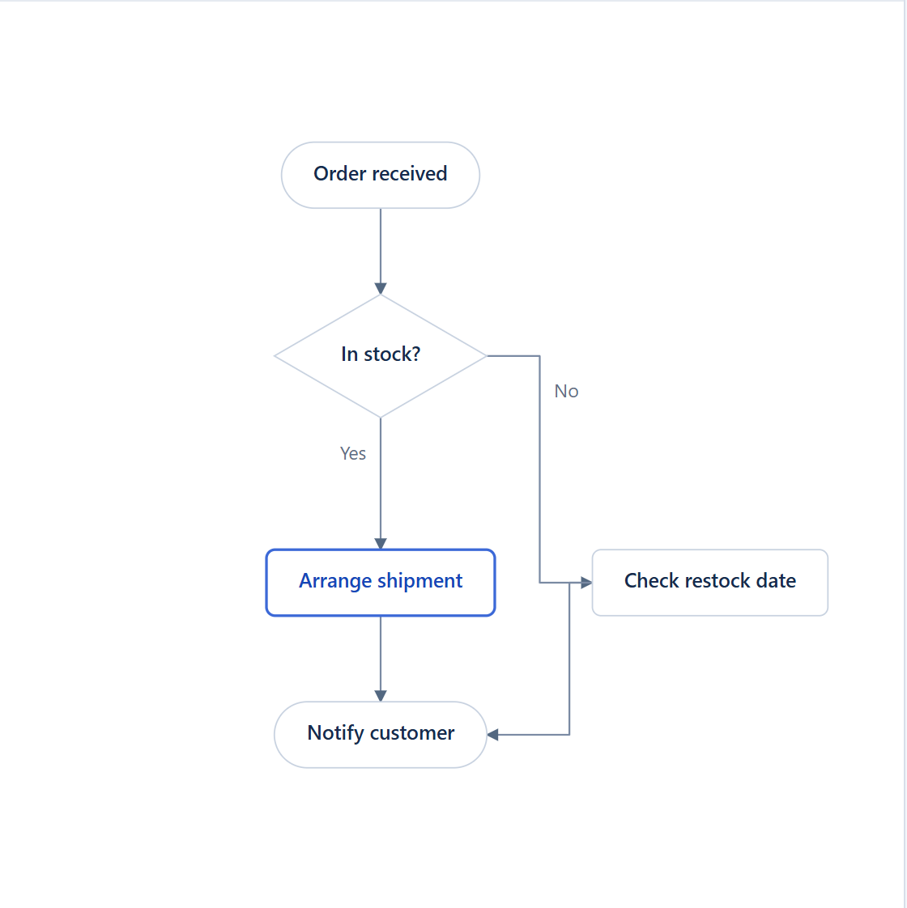
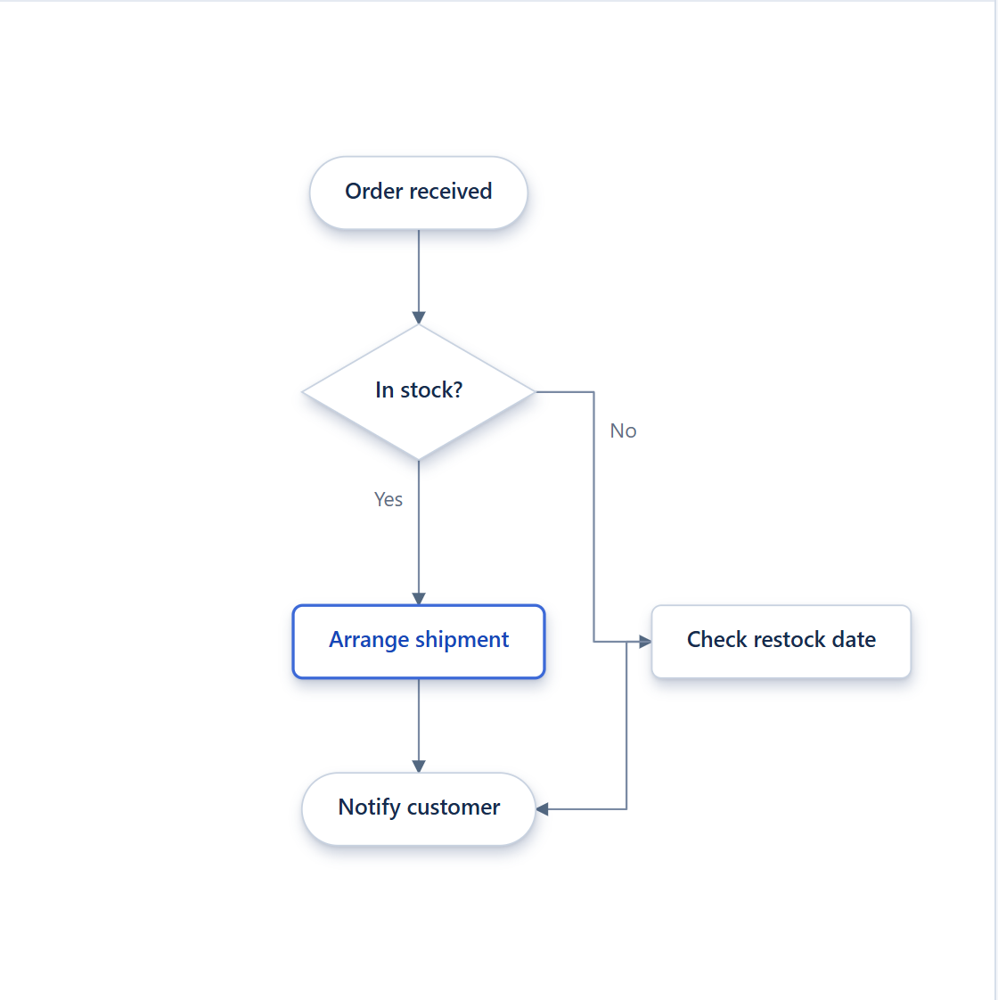
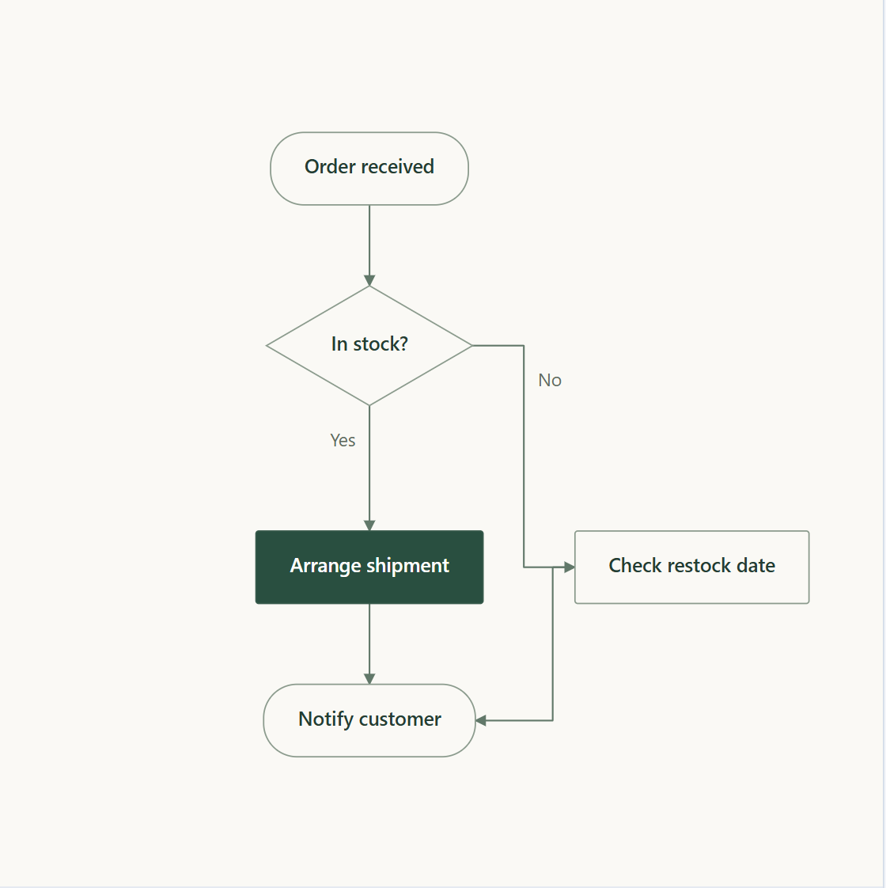

# Finch.js 

[Plugin development guide (Japanese)](./docs/plugin-development_ja.md)

[日本語](./README_ja.md)

# 🐦 Draw beautiful diagrams.

[](./examples/readme-hero.html)

This example groups order intake, event processing, and storage/delivery by responsibility. Each group reads vertically and shows the connections needed for this flow. The linked diagram is editable with the current repository build.

Turn concise text into polished SVG diagrams, then drag and pin nodes until the layout feels right. Stable node IDs keep those decisions when the text changes.

Diagram media are regenerated from the current repository build. [Sources and freshness record](./docs/diagram-media.md).

## Fine-tune your diagram

[](./examples/readme-demo.html)

[Tutorial](./docs/tutorial.md) · [Example gallery](./examples/README.md) · [npm package](https://www.npmjs.com/package/@hachiware-labs/finch-js)

## Save diagrams in Markdown

Use `exportMarkdown()` and `Finch.renderMarkdown()` to save and restore a diagram and its node positions in one code fence. See the [Markdown guide (Japanese)](./docs/markdown_ja.md).

## Quick start

From the repository root, run `npm ci` and `npm run build`. Save the following as `examples/diagram.html`, run `python -m http.server 8000`, and open `http://127.0.0.1:8000/examples/diagram.html`. This uses the current checkout.

```html
<!doctype html>
<meta charset="UTF-8" />
<meta name="viewport" content="width=device-width, initial-scale=1" />
<style>
  body { margin: 0; }
  #diagram { min-height: 100vh; overflow: auto; padding: 24px; }
</style>

<main id="diagram" aria-label="Order fulfillment flowchart"></main>

<script src="../dist/finch.global.js"></script>
<script>
  const orderFlowSource = `
@flowchart
start received "Order received"
process validate "Check inventory"
decision available "In stock?"
process reserve "Reserve items"
end confirmed "Order confirmed"
end backorder "Await restock"

received -> validate
validate -> available
available -> reserve: Yes
available -> backorder: No
reserve -> confirmed
  `.trim();

  Finch.render(orderFlowSource, { target: "#diagram" });
</script>
```

Press the pink bird icon in the diagram's lower-left to open Edit mode. Drag a node, then double-click it to pin the position. Change a visible label in the source and watch the diagram update without losing the hand-tuned layout. Nothing is persisted until you press Save.

IDs and labels are separate. Keep `validate` stable while changing `"Check inventory"`; the saved position belongs to the ID.

## Install

```bash
npm install @hachiware-labs/finch-js
```

```js
import Finch, { createFinch } from "@hachiware-labs/finch-js";
```

For a page saved under `examples/`, load the locally built browser bundle:

```html
<script src="../dist/finch.global.js"></script>
```

## Styles

The same flowchart, rendered in different styles.

<table>
<tr><td align="center"><strong>Default</strong><br></td><td align="center"><strong>Precision</strong><br></td></tr>
<tr><td align="center"><strong>Business</strong><br></td><td align="center"><strong>Business-shadow</strong><br></td></tr>
<tr><td align="center"><strong>Editorial</strong><br></td><td></td></tr>
</table>

[Compare styles](./examples/style-study.html), toggle shadows, and export SVGs. Business, Precision, and Editorial are custom theme examples defined in that page; Business-shadow is the shadow-enabled Business variant.

## Icons, role colors, and your images

Use `icon` and `tone` across all themes, including custom themes. Containers pass their tone to descendants; a child can override it or use `tone=none` to reset. Icon artwork is selected per node and is not inherited.

```text
@deployment
container services "Services" [tone=green] {
  node api "API" [icon=server]
  node auth "Auth" [icon=shield-check tone=coral]
}
```

Lucide is the default. Optional AWS, Azure, Google Cloud, Kubernetes, and Simple Icons packs use names such as `icon=aws:application-auto-scaling` and `icon=simple:github`. Load the required pack after Finch. Use `image="./photo.png"` for your own image, optionally with `imageShape=circle` or `imageShape=rounded`.

These features use the current repository build. Run `npm ci` and `npm run build`, then open the [icon and image example](./examples/icon-packs.html). See [the tutorial](./docs/tutorial.md#8-add-icons-role-colors-and-images) for a complete HTML example and export requirements, and [pack sources](./icon-packs/NOTICE.md) for asset versions and terms.

## Diagram types

| Directive | Use it for | Example |
| --- | --- | --- |
| `@deployment` | Systems and infrastructure | [Deployment](./examples/deployment.html) |
| `@graph` | General relationships and grouped systems | [Graph](./examples/graph.html) |
| `@sequence` | Ordered interactions | [Sequence](./examples/sequence.html) |
| `@flowchart` | Processes and decisions | [Flowchart](./examples/flowchart.html) |
| `@state` | Lifecycles and transitions | [State](./examples/state.html) |
| `@er` | Entities and relationships | [ER](./examples/er.html) |
| `@component` | Software boundaries and interfaces | [Component](./examples/component.html) |
| `@slide` | Presentation visuals | [Slide](./examples/slide.html) |
| `@class` | Classes and UML relationships | [Class](./examples/class.html) |
| `@usecase` | Actors and system goals | [Use case](./examples/usecase.html) |
| `@activity` | Actions and control flow | [Activity](./examples/activity.html) |

## Create diagrams with your coding agent

This repository includes a portable [`finch` skill](./.agents/skills/finch/SKILL.md) for coding agents. Ask your agent:

```text
Create an activity diagram for the order review flow in HTML with the Finch skill.
```

Codex discovers the skill automatically from this checkout; use `$finch` when you want to invoke it explicitly. To install the skill in another workspace or for another supported agent:

```bash
npx skills add hachiware-labs/finch-js --skill finch
```

The installer lets you select the target agent. You can also specify agents directly, for example with `--agent claude-code cursor`. Add `--global` to make the skill available across repositories, and restart an agent if a newly installed skill is not listed.

## Learn more

- [Tutorial](./docs/tutorial.md): render, arrange, update, save, and embed a diagram.
- [Reference](./docs/reference.md): syntax, editing controls, persistence, events, export, and the instance API.
- [Advanced examples](./examples/README.md): complete, editable diagrams for every supported type.
- [Extending Finch.js](./docs/extensions.md): custom diagrams, shapes, layouts, and themes.
- [Slide patterns](./docs/slide-patterns.md): reusable KPI, data-story, roadmap, comparison, and customer-evidence recipes.

## Development

```bash
npm ci
npm run check
```

To browse the examples locally, run `python -m http.server 8000` and open `http://127.0.0.1:8000/examples/`.

Finch.js is licensed under the [MIT License](./LICENSE).

<details>
<summary>Artwork credits</summary>

- Header silhouette adapted from a [Green Warbler-Finch photograph](https://www.inaturalist.org/observations/9398069) by Julien Renoult, licensed under [CC BY 4.0](https://creativecommons.org/licenses/by/4.0/).
- Footer silhouette adapted from [<i>Green warbler-finch on Santa Cruz Island</i>](https://commons.wikimedia.org/wiki/File:Green_warbler-finch_on_Santa_Cruz_Island.jpg) by Andrew Katsis, licensed under [CC BY 4.0](https://creativecommons.org/licenses/by/4.0/).

Both images were simplified, recolored, and repositioned as silhouettes.
</details>

<p align="right">
  
</p>


## Concise UML extensions

Use `note Order "Explanation"` or `constraint Item "quantity > 0"` for annotations, and `note api->stock "Idempotent"` for the first matching connection. Sequence frames accept `else condition` inside `alt` and `and description` inside `par`.

Use `state id { ... }` for composite states, `region id { ... }` for parallel regions, `lane id { ... }` for activity ownership, and `package id { ... }` for class packages. IDs remain unique across the diagram. State diagrams now flow downward by default; flat state diagrams accept `@state direction=LR`.

These features require the current repository build. See the [editable example](./examples/uml-concise.html) and [syntax and limitations (Japanese)](./docs/uml-concise_ja.md). Constraints are displayed, not executed. Class/object namespaces are supported; nested swimlanes are not. Nested state layouts remain vertical.


## Practical UML notation

Sequence diagrams distinguish synchronous `->`, asynchronous `->>`, and reply `-->` messages. Use `activate` / `deactivate` for explicit execution intervals, and `create` / `destroy` for lifetimes. State bodies accept `entry`, `exit`, `do`, and `internal`. Add roles with `stereotype id "service"`; class members accept `static` and `abstract` prefixes.

Activity diagrams accept `while id "condition" { ... }` and `repeat id "condition" { ... }`, with sequential action bodies and nested loops. Use `id.done` as the exit. Class relations accept `[fromRole=owner toRole=items]`, and `association Link A->B` attaches a declared association class to the first matching relationship.

See the [editable example](./examples/uml-practical.html) and [detailed syntax and limitations (Japanese)](./docs/uml-practical_ja.md). These features require the current repository build. They describe behavior and perform structural checks; they do not execute behavior. Explicit activations replace inference for the controlled participant. See the [current coverage ledger](docs/plantuml-parity_ja.md) for branch-dependent lifetimes, structured control flow and association-class connections.


[UML extensions and examples](examples/uml-complete.html) · [Syntax and validation](docs/uml-complete_ja.md)


Timing diagrams support discrete states, concise intervals, binary signals, analog values and clocks on a shared time axis. See the [editable timing example](examples/timing.html).


[Reusable source: includes, loops, functions and validation](docs/preprocessing.md)

[Notes and sequence pages](docs/annotations.md)


## Explore the UML examples

The [UML example guide](examples/uml-guide.html) pairs basic diagrams with deeper examples: branch-dependent lifetimes, state history and parallel regions, inheritance, loop interruption, association classes and templates. Use the editor button within each diagram to change its source. Structural checks do not execute behavior.
