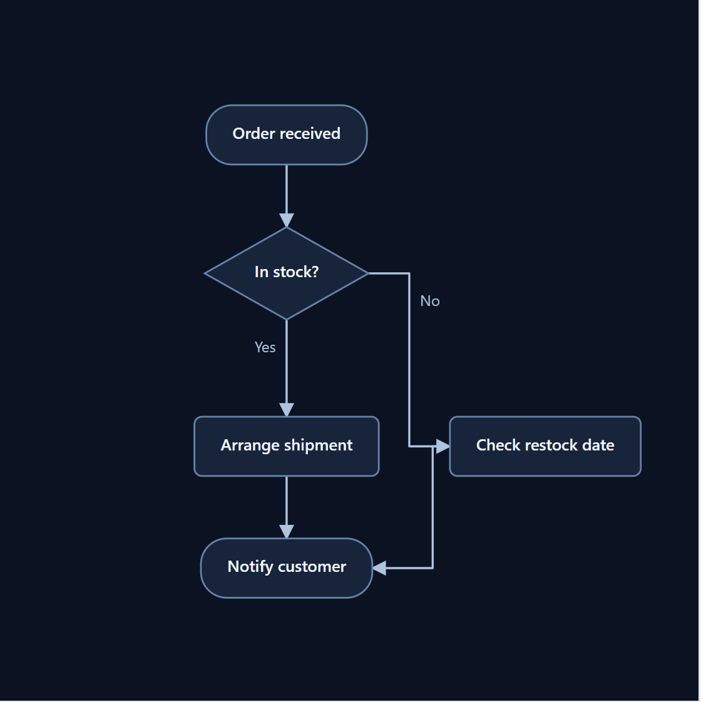
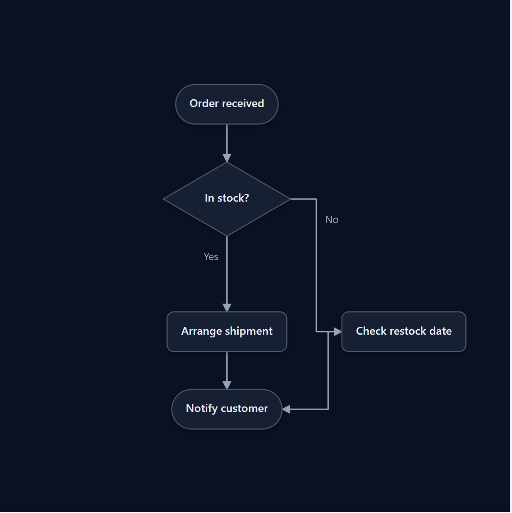

# Finch.js 

[日本語](./README_ja.md)

**Draw diagrams from text, then keep your hand-tuned layout as the text changes.** Finch.js renders editable SVG diagrams and preserves positions through stable node IDs.

[](https://hachiware-labs.github.io/finch-js/examples/readme-hero.html)

## Quick start

No install, no build. Save as `diagram.html` and open it.

```html
<!doctype html>
<meta charset="UTF-8" />
<meta name="viewport" content="width=device-width, initial-scale=1" />
<style>
  body { margin: 0; }
  #diagram { min-height: 100vh; overflow: auto; padding: 24px; }
</style>

<main id="diagram" aria-label="Application deployment diagram"></main>

<script src="https://cdn.jsdelivr.net/npm/@hachiware-labs/finch-js@0.7.0/dist/finch.global.js"></script>
<script>
  const deploymentSource = `
@deployment
node browser "Web app" [icon=app-window]
container cloud "Production" [layout=row tone=cyan] {
  server api "API server" [icon=server]
  database db "PostgreSQL" [icon=database]
}
browser -> api
api -> db: SQL
  `.trim();

  Finch.render(deploymentSource, { target: "#diagram" });
</script>
```

IDs and labels are separate. Keep `api` stable while changing `"API server"`; the saved position belongs to the ID.

## Click Finch to edit

Click the pink **Finch button** in the lower-left of the diagram to open the editor. Add elements and connections in **Source**, then drag and drop nodes to arrange the diagram.

[](https://hachiware-labs.github.io/finch-js/examples/readme-demo.html)

Edit the source again — the nodes you moved stay where you put them. Keep their IDs unchanged.

The demo adds a Redis cache, connects it to the API server, and moves the nodes into place. [Try the editable deployment example](https://hachiware-labs.github.io/finch-js/examples/readme-demo.html). Press **Save** to save your source and layout together as editable HTML, or follow the [15-minute tutorial](./docs/tutorial.md).

[Tutorial](./docs/tutorial.md) · [Example gallery](./examples/README.md) · [npm package](https://www.npmjs.com/package/@hachiware-labs/finch-js)

## Diagram types

| Directive | Use it for | Example |
| --- | --- | --- |
| `@deployment` | Systems and infrastructure | [Deployment](https://hachiware-labs.github.io/finch-js/examples/deployment.html) |
| `@graph` | General relationships and grouped systems | [Graph](https://hachiware-labs.github.io/finch-js/examples/graph.html) |
| `@sequence` | Ordered interactions | [Sequence](https://hachiware-labs.github.io/finch-js/examples/sequence.html) |
| `@flowchart` | Processes and decisions | [Flowchart](https://hachiware-labs.github.io/finch-js/examples/flowchart.html) |
| `@state` | Lifecycles and transitions | [State](https://hachiware-labs.github.io/finch-js/examples/state.html) |
| `@er` | Entities and relationships | [ER](https://hachiware-labs.github.io/finch-js/examples/er.html) |
| `@component` | Software boundaries and interfaces | [Component](https://hachiware-labs.github.io/finch-js/examples/component.html) |
| `@slide` | Presentation visuals | [Slide](https://hachiware-labs.github.io/finch-js/examples/slide.html) |
| `@class` | Classes and UML relationships | [Class](https://hachiware-labs.github.io/finch-js/examples/class.html) |
| `@usecase` | Actors and system goals | [Use case](https://hachiware-labs.github.io/finch-js/examples/usecase.html) |
| `@activity` | Actions and control flow | [Activity](https://hachiware-labs.github.io/finch-js/examples/activity.html) |
| `@timing` | Signals and states over time | [Timing](https://hachiware-labs.github.io/finch-js/examples/timing.html) |

## Install

```bash
npm install @hachiware-labs/finch-js
```

```js
import Finch from "@hachiware-labs/finch-js";
```

For standalone HTML, load the browser bundle:

```html
<script src="https://cdn.jsdelivr.net/npm/@hachiware-labs/finch-js@0.7.0/dist/finch.global.js"></script>
```

## Styles

The same flowchart, rendered in different styles.

<table>
<tr>
<td align="center" width="50%"><strong>Default</strong><br><a href="https://hachiware-labs.github.io/finch-js/examples/style-study.html"></a></td>
<td align="center" width="50%"><strong>Prism</strong><br><a href="https://hachiware-labs.github.io/finch-js/examples/style-study.html"></a></td>
</tr>
<tr>
<td align="center" width="50%"><strong>Midnight</strong><br><a href="https://hachiware-labs.github.io/finch-js/examples/style-study.html"></a></td>
<td align="center" width="50%"><strong>Precision</strong><br><a href="https://hachiware-labs.github.io/finch-js/examples/style-study.html"></a></td>
</tr>
<tr>
<td align="center" width="50%"><strong>Business</strong><br><a href="https://hachiware-labs.github.io/finch-js/examples/style-study.html"></a></td>
<td align="center" width="50%"><strong>Business + shadow</strong><br><a href="https://hachiware-labs.github.io/finch-js/examples/style-study.html"></a></td>
</tr>
<tr>
<td align="center" width="50%"><strong>Editorial</strong><br><a href="https://hachiware-labs.github.io/finch-js/examples/style-study.html"></a></td>
<td align="center" width="50%"><strong>Editorial + shadow</strong><br><a href="https://hachiware-labs.github.io/finch-js/examples/style-study.html"></a></td>
</tr>
</table>

[Compare styles](https://hachiware-labs.github.io/finch-js/examples/style-study.html), toggle shadows, and export SVGs. Default, Prism, and Midnight are built-in themes. Business, Precision, and Editorial are custom theme examples defined in that page; “+ shadow” shows a shadow-enabled variant.

## Icons, role colors, and your images

Use `icon` and `tone` across all themes, including custom themes. Containers pass their tone to descendants; a child can override it or use `tone=none` to reset. Icon artwork is selected per node and is not inherited.

```text
@deployment
container services "Services" [tone=green] {
  node api "API" [icon=server]
  node auth "Auth" [icon=shield-check tone=coral]
}
```

Lucide is the default. Optional AWS, Azure, Google Cloud, Kubernetes, and Simple Icons packs use names such as `icon=aws:application-auto-scaling` and `icon=simple:github`. Load the required pack after Finch. Use `image="./photo.png"` for your own image, optionally with `imageShape=circle` or `imageShape=rounded`.

For icons in 0.7.0, open the [icon and image example](https://hachiware-labs.github.io/finch-js/examples/icon-packs.html). See [the icon guide](./docs/icons.md) for a complete HTML example and export requirements, and [pack sources](./icon-packs/NOTICE.md) for asset versions and terms.

## Create diagrams with your coding agent

This repository includes a portable [`finch` skill](./.agents/skills/finch/SKILL.md) for coding agents. Ask your agent:

```text
Create an activity diagram for the order review flow in HTML with the Finch skill.
```

Codex discovers the skill automatically from this checkout; use `$finch` when you want to invoke it explicitly. To install the skill in another workspace or for another supported agent:

```bash
npx skills add hachiware-labs/finch-js --skill finch
```

The installer lets you select the target agent. You can also specify agents directly, for example with `--agent claude-code cursor`. Add `--global` to make the skill available across repositories, and restart an agent if a newly installed skill is not listed.

## Save diagrams in Markdown

Use `exportMarkdown()` and `Finch.renderMarkdown()` to save and restore a diagram and its node positions in one code fence. See the [Markdown guide (Japanese)](./docs/markdown_ja.md).

## Learn more

- [Tutorial](./docs/tutorial.md): draw, arrange, edit, save, and choose a type in about 15 minutes.
- [Reference](./docs/reference.md): syntax, editing controls, persistence, events, export, and the instance API.
- [Examples](./examples/README.md): complete, editable diagrams for every supported type.
- [Extending Finch.js](./docs/extensions.md): custom diagrams, shapes, layouts, and themes.
- [Slide patterns](./docs/slide-patterns.md): reusable KPI, data-story, roadmap, comparison, and customer-evidence recipes.
- [Embedding and saving](./docs/embedding.md)
- [Generate a diagram from a prompt](./docs/generating.md)
- [UML examples and extensions](https://hachiware-labs.github.io/finch-js/examples/uml-guide.html)
- [Includes, loops, and functions](./docs/preprocessing.md)
- [Notes and sequence pages](./docs/annotations.md)
- [Plugin development guide (Japanese)](./docs/plugin-development_ja.md)

## Development

```bash
npm ci
npm run check
```

To browse the examples locally, run `python -m http.server 8000` and open `http://127.0.0.1:8000/examples/`.

Images and linked examples use the repository build. [Sources and freshness record](./docs/diagram-media.md).

Finch.js is licensed under the [MIT License](./LICENSE).

<details>
<summary>Artwork credits</summary>

- Header silhouette adapted from a [Green Warbler-Finch photograph](https://www.inaturalist.org/observations/9398069) by Julien Renoult, licensed under [CC BY 4.0](https://creativecommons.org/licenses/by/4.0/).
- Footer silhouette adapted from [<i>Green warbler-finch on Santa Cruz Island</i>](https://commons.wikimedia.org/wiki/File:Green_warbler-finch_on_Santa_Cruz_Island.jpg) by Andrew Katsis, licensed under [CC BY 4.0](https://creativecommons.org/licenses/by/4.0/).

Both images were simplified, recolored, and repositioned as silhouettes.
</details>

<p align="right">
  
</p>
