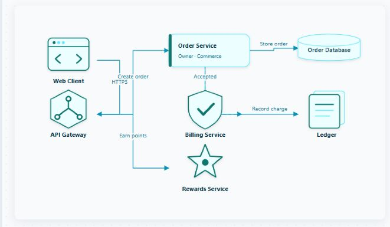
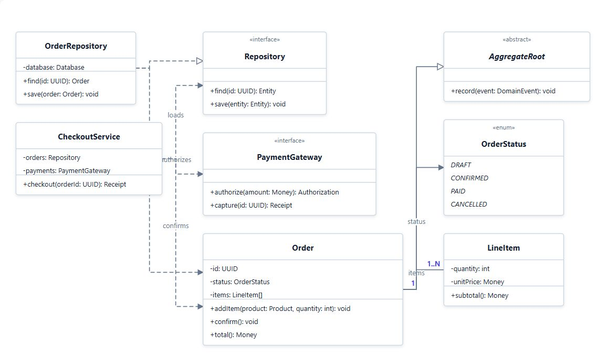
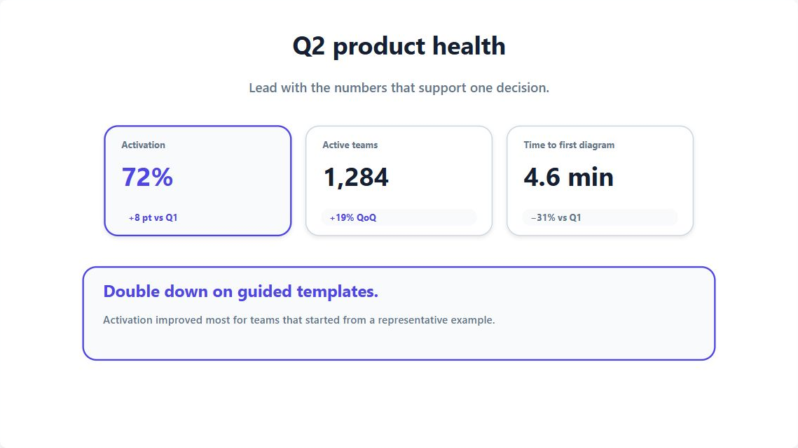

# Finch.js 

[日本語](./README_ja.md)

🐦 **Generate fast. Fine-tune freely.** Finch.js turns concise text into polished SVG diagrams in moments. Drag and pin nodes to refine the layout by hand without rewriting the source.

[](./examples/extensions.html)

## Representative examples

| UML class diagram | KPI summary slide |
| --- | --- |
| [](./examples/class.html) | [](./examples/slide-patterns.html) |
| Model structure and relationships with `@class` | Headline metrics and one decision with `@slide` |

## Quick start: two steps

### 1. Put this in an HTML file

Create `quickstart.html` in the repository root and paste in the following:

```html
<!doctype html>
<meta charset="UTF-8" />
<style>
  body { min-height: 100vh; margin: 0; }
  #diagram { min-height: 100vh; overflow: auto; padding: 24px; }
</style>

<div id="diagram" aria-label="Deployment diagram"></div>

<script src="./dist/finch.global.js"></script>
<script>
  const deploymentSource = `
@deployment
node browser "Web Browser" [shape=rounded]
server api "API Server"
database db "PostgreSQL"
browser -> api: HTTPS
api -> db: SQL
  `.trim();

  Finch.render(deploymentSource, {
    target: "#diagram",
    editor: { storageKey: "finch-quickstart" },
  });
</script>
```

Open `quickstart.html` in a browser to turn the text into a diagram.

### 2. Drag and save

Drag nodes to refine the layout. Open the Finch button inside the diagram's lower-left to reveal the editor below the diagram, undo changes, and export SVG or PNG. Nothing is persisted until you press Save; saved source and layout are restored after a reload.

See the [two-step tutorial](./docs/tutorial.md) for details or browse the [advanced examples](./examples/README.md) for complete diagrams.

## Environment setup

Install Finch.js from npm:

```bash
npm install @hachiware-labs/finch-js
```

Then import the default instance or create an isolated one:

```js
import Finch, { createFinch } from "@hachiware-labs/finch-js";
```

For a browser-global build, use a version-pinned CDN URL:

```html
<script src="https://cdn.jsdelivr.net/npm/@hachiware-labs/finch-js@0.5.1/dist/finch.global.js"></script>
```

When developing Finch.js itself, install the repository dependencies and build it:

```bash
npm ci
npm run build
```

To serve the repository over HTTP, start a local server:

```bash
python -m http.server 8000
```

Open `http://127.0.0.1:8000/quickstart.html` in a browser.

## Codex skill

This repository includes the [`$finch` Codex skill](./.agents/skills/finch/SKILL.md) for creating or updating HTML pages that render Finch.js diagrams. It keeps the diagram source in a JavaScript string inside the HTML rather than delivering a standalone `.finch` file.

### Use it in this repository

No separate installation command is needed. Start Codex from this repository or one of its subdirectories; Codex discovers `.agents/skills/finch` automatically. Invoke it explicitly with a prompt such as:

```text
$finch Draw an activity diagram in HTML.
```

If the skill does not appear after cloning or updating the repository, restart Codex.

### Install it with the Skills CLI

The [`skills` CLI](https://github.com/vercel-labs/skills) can discover and install the skill. From a local Finch.js checkout, run:

```bash
npx skills add . --skill finch
```

After the repository is available on GitHub, install it directly with the repository name:

```bash
npx skills add hachiware-labs/finch-js --skill finch
```

Add `--global` to make `$finch` available across all of your repositories:

```bash
npx skills add hachiware-labs/finch-js --skill finch --global
```

To inspect the available skills without installing them, use `npx skills add hachiware-labs/finch-js --list`. Codex detects newly installed skills automatically; restart Codex if `$finch` is not listed. See the [official OpenAI skill documentation](https://learn.chatgpt.com/docs/build-skills) for Codex skill scopes and discovery locations.

## Diagram types

Ten diagram types cover architecture, interactions, processes, state transitions, data models, component structures, presentation visuals, and core UML views.

| Directive | Use it for | Main declarations |
| --- | --- | --- |
| [`@deployment`](./examples/deployment.html) | Systems and infrastructure | `node`, `device`, `execution`, `artifact`, `server`, `database`, `container` |
| [`@sequence`](./examples/sequence.html) | Ordered interactions | `participant`, `actor`, messages, `group`, `alt`, `opt`, `loop`, `par`, `critical`, `break` |
| [`@flowchart`](./examples/flowchart.html) | Processes and decisions | `start`, `process`, `decision`, `input`, `output`, `end` |
| [`@state`](./examples/state.html) | State machines | `initial`, `state`, `choice`, `fork`, `join`, `history`, `deep-history`, `final` |
| [`@er`](./examples/er.html) | Entities and relationships | `entity`, fields, `pk`, `fk`, `unique`, cardinalities |
| [`@component`](./examples/component.html) | Software components and boundaries | `system`, `component`, `port`, `provided`, `required`, `artifact`, `external` |
| [`@slide`](./examples/slide.html) | Presentation diagrams | `title`, `subtitle`, layouts, `card`, `metric`, `bar`, `quote`, `milestone`, `callout`, `arrow` |
| [`@class`](./examples/class.html) | UML class diagrams | `class`, `abstract`, `interface`, `enum`, members, UML relationships, multiplicities |
| [`@usecase`](./examples/usecase.html) | UML use case diagrams | `actor`, `system`, `usecase`, `include`, `extend`, `generalize` |
| [`@activity`](./examples/activity.html) | UML activity diagrams | `action`, `decision`, `merge`, `fork`, `join`, `object`, guards |

For reusable KPI, data-story, roadmap, comparison, and customer-evidence recipes, open the [slide pattern guide](./docs/slide-patterns.md) or the [live pattern gallery](./examples/slide-patterns.html).

Solid arrows use `->`; dashed arrows use `-->`. Add a label after a colon:

```text
api -> worker: Dispatch job
worker --> api: Accepted
```

Node IDs and labels are separate. Keep the ID stable when changing the visible label so manual positions survive source updates:

```text
server billing-api "Billing API"
```

### Long node labels

Standard node labels stay on one line while they fit. Finch.js wraps a longer label at a word boundary, or between characters when needed, and makes the node taller so every line remains readable.

### Deployment layout hints

Deployment containers accept `layout=row`, `layout=column`, or `layout=grid`. Use `columns` on a grid container, and use `order`, `row`, and `column` on its direct children for finer placement. A top-level container with `place=below` stays in the same horizontal band as its predecessor instead of adding another column. These hints guide automatic layout; dragging and pinning remain available for exact positioning.

Flowcharts use a vertical reading direction by default. The main path runs from top to bottom, while nodes in the same decision rank spread horizontally.

In state diagrams, a fork/join section also reads vertically: parallel states sit between a fork bar above and a join bar below, followed by the joined successor. Transitions touching a fork or join automatically use top/bottom ports. Override an endpoint when needed with `[fromPort=bottom toPort=top]`; each value may be `top`, `right`, `bottom`, or `left`.

Comments can use a leading apostrophe on a full line, or `#` and `//` after whitespace.

## Editing and persistence

New diagrams start with edit mode on. Use `setEditable(false)` for view mode; a plain left-button drag then pans inside the diagram instead of moving a node. Zoom in, zoom out, and reset remain viewing operations, while Fit, layout changes, pinning, and node selection are disabled.

```js
diagram.setEditable(false);
diagram.setEditable(true);
```

With edit mode on, the SVG supports:

- Drag a node to give it a manual position.
- When a node inside a deployment container moves, that container and every outer container fit their current contents on all four sides. For example, moving the only child to the right advances the right edge and contracts the empty space on the left. A frame never becomes smaller than the size required by its own shape and label.
- Ctrl/⌘/Shift-click to select multiple nodes, then drag them together.
- Double-click a node to toggle its pinned state.
- Press `P` to pin selected nodes or `Escape` to clear the selection.
- Use Ctrl/⌘ + wheel to zoom, and Space/Alt + drag to pan a scrollable diagram.
- Call `autoLayout()` to arrange unpinned nodes again.
- Call `resetLayout()` to discard every manual position and pin.

The semantic source and manual layout are intentionally stored separately. `exportLayout()` includes the `editable` flag, so saving while edit mode is off restores the diagram in view mode. Older overlays without the flag default to edit mode on.

```js
const json = diagram.exportLayout();
localStorage.setItem("diagram-layout", json);

diagram.importLayout(localStorage.getItem("diagram-layout"));
```

When a drag, pin, layout command, or edit-mode change updates the overlay, the SVG emits a bubbling `finch:layoutchange` event. Its `detail` contains `{ overlay, changedNodeIds }`. Edit-mode changes also emit `finch:editchange` with `{ editable, overlay }` for toolbar synchronization.

For an explicit editing session, mark the session dirty when `changedNodeIds` is non-empty and persist `exportLayout()` only when the user presses Save. Switching Edit ON/OFF does not imply saving.

Use `diagram.update(nextSource)` for live editors. Nodes with the same stable ID retain their existing layout. Use `diagram.toSvgString()` when you need the generated SVG markup.

The standard editor is added by `Finch.render()`. A Finch button is embedded inside the lower-left of the generated SVG and toggles the controls plus a source pane directly below the diagram. The diagram stays in view mode while this editor is closed and restores the editing-session state when it opens. Save persists the source and layout to `localStorage`; Edit ON/OFF never saves implicitly. SVG and PNG exports omit the UI-only Finch button.

```js
const diagram = Finch.render(source, {
  target: "#diagram",
  editor: { storageKey: "system-map" },
});
```

The menu includes Undo, zoom, Fit, Pin, automatic layout, reset, SVG, and PNG actions. Use `editor: false` for a bare diagram, or `Finch.attachEditor()` when adding the editor later to an instance that was created without it.

### Edge routes

Built-in layouts choose an edge route in this order:

1. Avoid nodes.
2. Reduce crossings with other edges.
3. Reduce right-angle bends.
4. Prefer the shorter route when the other results are equal.

This routing runs during the first render, `update()`, layout import, and rerouting after a node moves. It first keeps visual space around nodes. In a narrow gap, it reduces that space while still avoiding the node itself. The first and last segment keep their original heading, so an arrow approaches the node boundary from outside. If overlapping nodes leave no safe route, Finch.js keeps the established basic route instead of dropping the edge.

### Save as SVG or PNG

Call `downloadSvg()` to save the current diagram as SVG. Editor UI, including the Finch button, is removed from the image output.

```js
diagram.downloadSvg("system-map.svg");
```

Call `downloadPng()` to save the current diagram as a PNG file. The image includes node positions after editing. Viewport zoom does not change the PNG dimensions.

```js
await diagram.downloadPng("system-map.png");
```

Call `toPngBlob()` when you need a `Blob` to upload or store yourself. Set `scale` to change the image dimensions, or set `background: null` for a transparent background.

```js
const png = await diagram.toPngBlob({ scale: 2 });
```

Viewport zoom is separate from semantic geometry and the saved layout overlay. Automatic zoom only shrinks diagrams that are wider than their host; it never enlarges a small diagram beyond 100%.

```js
diagram.zoomIn();
diagram.zoomOut();
diagram.setZoom(1.25);
diagram.fit("diagram");
diagram.fit("width");
diagram.resetZoom();
```

Zoom is clamped to 25–200% by default. Override that range with `minZoom` and `maxZoom` in `Finch.render()`. A bubbling `finch:zoomchange` event exposes `{ zoom, mode }` for toolbar synchronization.

## Themes and extensions

Choose a built-in theme when rendering, or switch later:

```js
const diagram = Finch.render(source, {
  target: "#diagram",
  theme: "midnight",
});

diagram.setTheme("default");
diagram.setLayout("compact");
```

Create an isolated engine when extensions should not modify the shared default registry:

```js
import { createFinch } from "@hachiware-labs/finch-js";

const finch = createFinch();
finch.registerDiagram("custom", diagramPlugin);
finch.registerShape("custom-shape", shapePlugin);
finch.registerLayout("custom-layout", layoutPlugin);
finch.registerTheme("brand", themePlugin);
```

See [Extending Finch.js](./docs/extensions.md) for complete plugin contracts and the [browser extension example](./examples/extensions.html) for a working custom diagram, card and icon shapes, layout, and theme.

## API at a glance

`Finch.render()` returns a `DiagramInstance` with these main operations:

| Operation | Purpose |
| --- | --- |
| `update(source)` | Reparse and redraw while preserving stable-node layout |
| `setTheme(theme)` / `setLayout(name)` | Change presentation |
| `select(ids)` / `clearSelection()` | Manage selection from code |
| `pin(ids)` / `unpin(ids)` | Protect or release manual positions |
| `autoLayout()` / `resetLayout()` / `undoLayout()` | Recalculate, clear, or undo layout state |
| `setZoom(value)` / `zoomIn()` / `zoomOut()` | Control viewport magnification |
| `setEditable(value)` / `editable` / `canUndo` | Switch edit mode and inspect whether Undo is available |
| `fit("diagram")` / `fit("width")` / `resetZoom()` | Fit or reset the viewport |
| `exportLayout()` / `importLayout(value)` | Persist the layout overlay |
| `saveLayout(target?)` | Write the overlay into a JSON script element |
| `toSvgString()` | Serialize the current SVG |
| `downloadSvg(filename?)` | Save the current diagram as an SVG file |
| `toPngBlob(options?)` | Create a PNG `Blob` from the current diagram |
| `downloadPng(filename?, options?)` | Save the current diagram as a PNG file |
| `Finch.attachEditor(instance, options?)` | Add the diagram-anchored HTML edit menu and source pane |
| `destroy()` | Remove the SVG and disable the instance |

The package includes TypeScript declarations for the public API and plugin interfaces.

## Artwork credits

- Header silhouette adapted from a [Green Warbler-Finch photograph](https://www.inaturalist.org/observations/9398069) by Julien Renoult, licensed under [CC BY 4.0](https://creativecommons.org/licenses/by/4.0/). The background was removed and the bird was simplified, recolored, and repositioned as a silhouette.
- Footer silhouette adapted from [*Green warbler-finch on Santa Cruz Island*](https://commons.wikimedia.org/wiki/File:Green_warbler-finch_on_Santa_Cruz_Island.jpg) by Andrew Katsis, licensed under [CC BY 4.0](https://creativecommons.org/licenses/by/4.0/). The background was removed and the bird was simplified, recolored, and repositioned as a silhouette.

## Development

```bash
npm run typecheck
npm test
npm run build
npm run check
```

`npm run check` runs type checking, tests, and a production build. Finch.js is licensed under the [MIT License](./LICENSE).

<p align="right">
  
</p>
