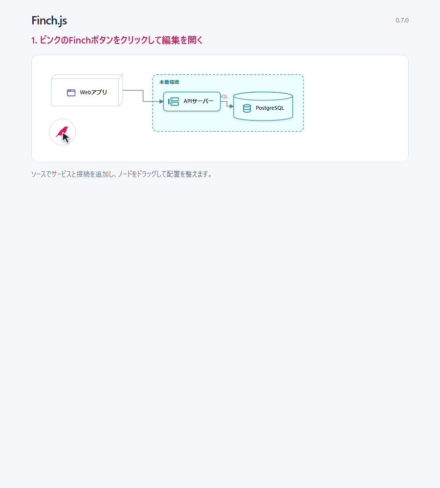
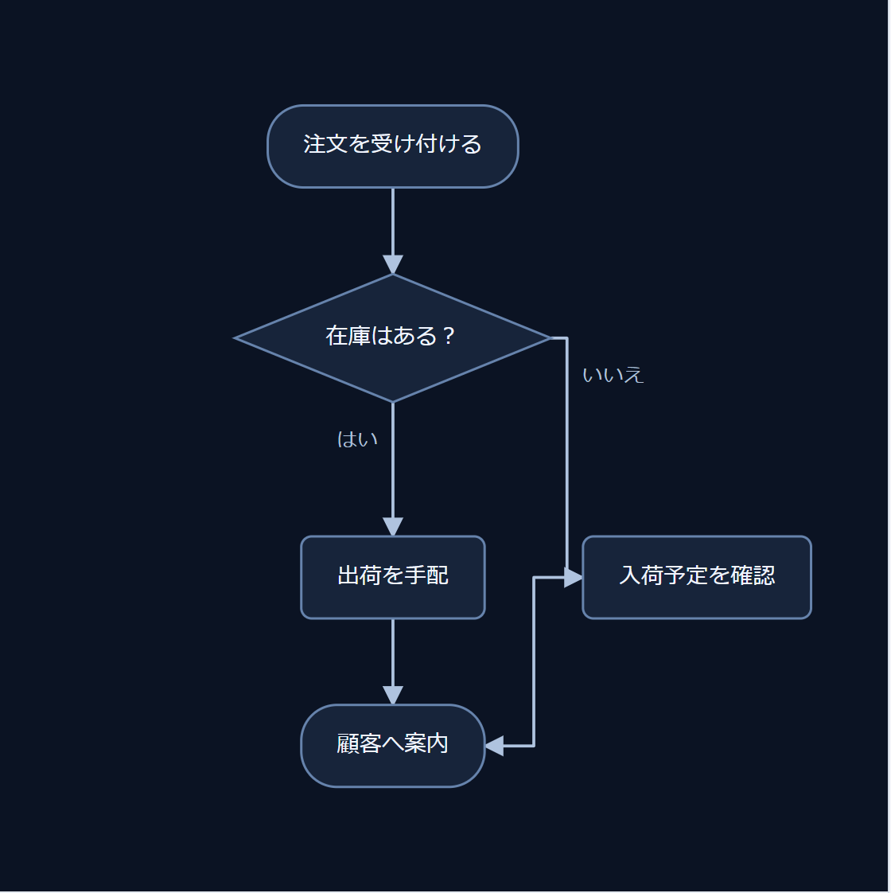
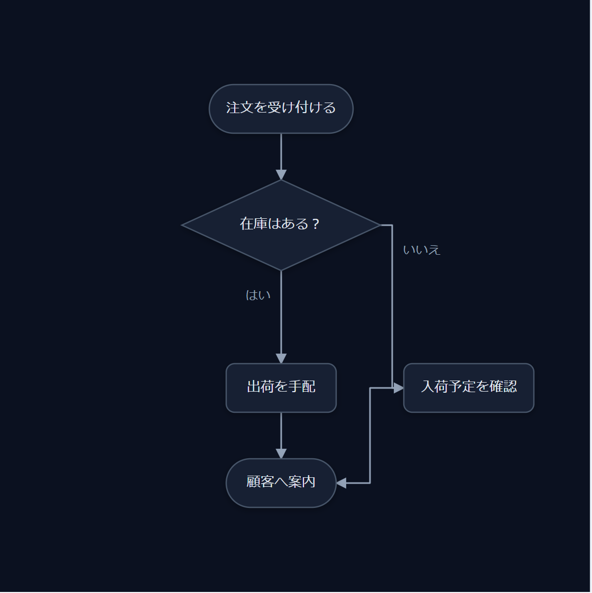
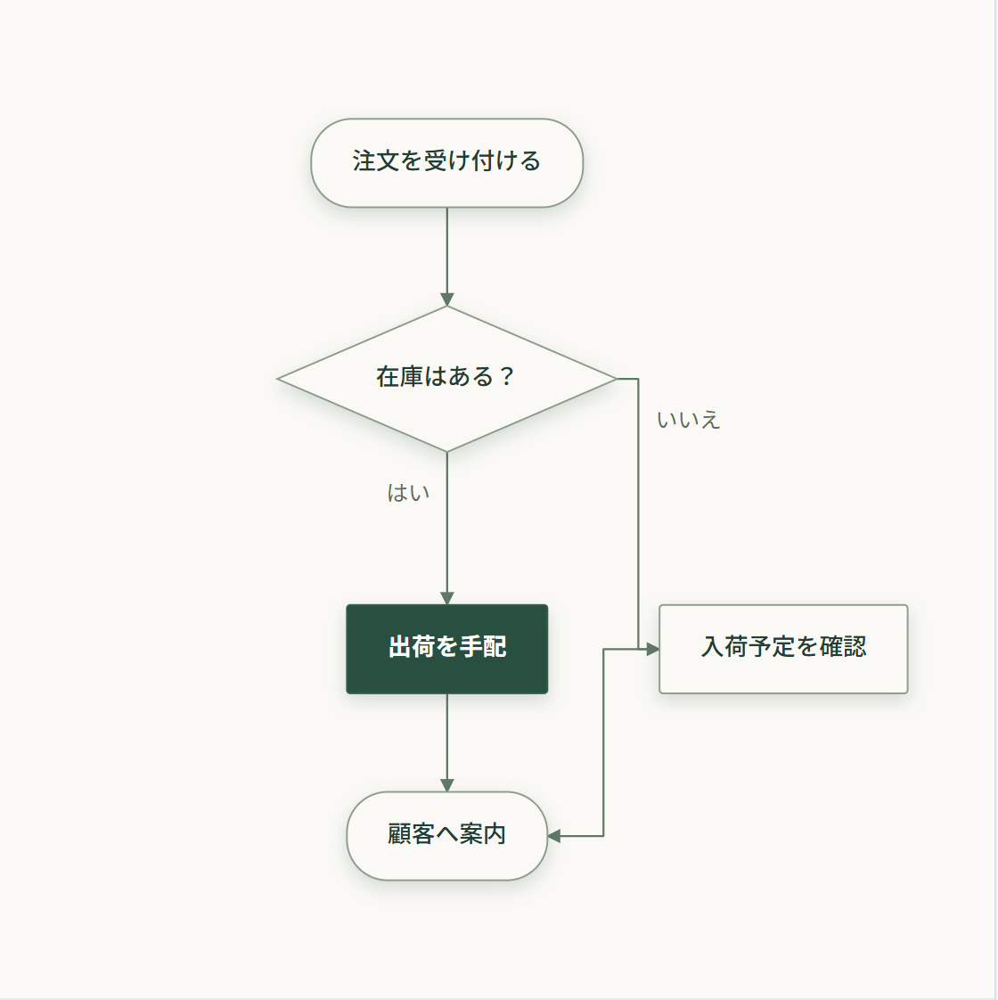

# Finch.js 

## きれいな図を描こう

[English](./README.md)

**テキストで図を描き、手で整えた配置を、テキストの変更後も保つ。** ノードIDで配置を引き継ぐ、編集可能なSVGダイアグラムライブラリです。

[](https://hachiware-labs.github.io/finch-js/examples/readme-hero.html?lang=ja)

## クイックスタート

インストールもビルドも不要。`diagram.html` に保存してブラウザーで開くだけです。

```html
<!doctype html>
<meta charset="UTF-8" />
<meta name="viewport" content="width=device-width, initial-scale=1" />
<style>
  body { margin: 0; }
  #diagram { min-height: 100vh; overflow: auto; padding: 24px; }
</style>

<main id="diagram" aria-label="アプリケーションの配備図"></main>

<script src="https://cdn.jsdelivr.net/npm/@hachiware-labs/finch-js@0.7.0/dist/finch.global.js"></script>
<script>
  const deploymentSource = `
@deployment
node browser "Web app" [icon=app-window]
container cloud "Production" [layout=row tone=cyan] {
  server api "API server" [icon=server]
  database db "PostgreSQL" [icon=database]
}
browser -> api
api -> db: SQL
  `.trim();

  Finch.render(deploymentSource, { target: "#diagram" });
</script>
```

IDと表示名は別です。`api` は変えず、`"API server"` だけを書き換えれば、保存した位置を引き継げます。

## Finchをクリックして編集する

図の左下にあるピンクの **Finchボタン** をクリックすると、エディターが開きます。**Source** で要素と接続を追加し、ノードをドラッグ＆ドロップして配置を整えます。

[](https://hachiware-labs.github.io/finch-js/examples/readme-demo.html?lang=ja)

ソースをもう一度書き換えても、移動したノードは手で決めた位置を保ちます。ノードのIDはそのままにしてください。

デモではRedisキャッシュを追加し、APIサーバーから接続をつないで、ノードを移動しています。[編集できる配備図の作例](https://hachiware-labs.github.io/finch-js/examples/readme-demo.html?lang=ja)で試せます。**Save** を押すと、ソースと配置をまとめて編集可能なHTMLに保存できます。一通りの操作は[15分チュートリアル](./docs/tutorial_ja.md)で確認できます。

[チュートリアル](./docs/tutorial_ja.md) · [作例を見る](./examples/README.md) · [npm パッケージ](https://www.npmjs.com/package/@hachiware-labs/finch-js)

## ダイアグラムの種類

| ディレクティブ | 用途 | 作例 |
| --- | --- | --- |
| `@deployment` | システムやインフラの構成 | [Deployment](https://hachiware-labs.github.io/finch-js/examples/deployment.html) |
| `@graph` | 汎用的な関係とグループ化したシステム | [Graph](https://hachiware-labs.github.io/finch-js/examples/graph.html) |
| `@sequence` | 時系列のやり取り | [Sequence](https://hachiware-labs.github.io/finch-js/examples/sequence.html) |
| `@flowchart` | 手順や分岐 | [Flowchart](https://hachiware-labs.github.io/finch-js/examples/flowchart.html) |
| `@state` | 状態と遷移 | [State](https://hachiware-labs.github.io/finch-js/examples/state.html) |
| `@er` | エンティティと関連 | [ER](https://hachiware-labs.github.io/finch-js/examples/er.html) |
| `@component` | ソフトウェアの境界とインターフェース | [Component](https://hachiware-labs.github.io/finch-js/examples/component.html) |
| `@slide` | プレゼンテーション用の図 | [Slide](https://hachiware-labs.github.io/finch-js/examples/slide.html) |
| `@class` | クラスと UML の関係 | [Class](https://hachiware-labs.github.io/finch-js/examples/class.html) |
| `@usecase` | アクターとシステムの目的 | [Use case](https://hachiware-labs.github.io/finch-js/examples/usecase.html) |
| `@activity` | アクションと制御フロー | [Activity](https://hachiware-labs.github.io/finch-js/examples/activity.html) |
| `@timing` | 信号と状態の時間変化 | [Timing](https://hachiware-labs.github.io/finch-js/examples/timing.html) |

## インストール

エディタ拡張や投稿サービスへの組み込みには、[プラグイン開発ガイド](./docs/plugin-development_ja.md)を参照してください。変更通知、保存コールバック、Markdownへの書き戻し、復元とフリーズの契約をまとめています。

```bash
npm install @hachiware-labs/finch-js
```

```js
import Finch from "@hachiware-labs/finch-js";
```

script 要素から使う場合は、ブラウザーグローバル版を読み込みます。

```html
<script src="https://cdn.jsdelivr.net/npm/@hachiware-labs/finch-js@0.7.0/dist/finch.global.js"></script>
```

## スタイル一覧

同じフローチャートを、スタイルを変えて描いています。

<table>
<tr>
<td align="center" width="50%"><strong>Default</strong><br><a href="https://hachiware-labs.github.io/finch-js/examples/style-study.html"></a></td>
<td align="center" width="50%"><strong>Prism</strong><br><a href="https://hachiware-labs.github.io/finch-js/examples/style-study.html"></a></td>
</tr>
<tr>
<td align="center" width="50%"><strong>Midnight</strong><br><a href="https://hachiware-labs.github.io/finch-js/examples/style-study.html"></a></td>
<td align="center" width="50%"><strong>Precision</strong><br><a href="https://hachiware-labs.github.io/finch-js/examples/style-study.html"></a></td>
</tr>
<tr>
<td align="center" width="50%"><strong>Business</strong><br><a href="https://hachiware-labs.github.io/finch-js/examples/style-study.html"></a></td>
<td align="center" width="50%"><strong>Business + shadow</strong><br><a href="https://hachiware-labs.github.io/finch-js/examples/style-study.html"></a></td>
</tr>
<tr>
<td align="center" width="50%"><strong>Editorial</strong><br><a href="https://hachiware-labs.github.io/finch-js/examples/style-study.html"></a></td>
<td align="center" width="50%"><strong>Editorial + shadow</strong><br><a href="https://hachiware-labs.github.io/finch-js/examples/style-study.html"></a></td>
</tr>
</table>

[スタイル比較ページ](https://hachiware-labs.github.io/finch-js/examples/style-study.html)で図の種類や影の有無を切り替え、SVGを保存できます。Default・Prism・Midnightは組み込みテーマ、Business・Precision・Editorialは比較ページで定義したカスタムテーマの作例です。「+ shadow」は影ありのバリエーションです。

## アイコン・役割色・自分の画像

`icon` と `tone` は、独自テーマを含む全テーマで共通に使えます。コンテナの `tone` は子孫へ継承され、子の指定で上書き、`tone=none` で解除できます。アイコンの絵柄は各ノードで指定し、継承しません。

```text
@deployment
container services "サービス" [tone=green] {
  node api "API" [icon=server]
  node auth "認証" [icon=shield-check tone=coral]
}
```

デフォルトはLucideです。AWS・Azure・Google Cloud・Kubernetes・Simple Iconsの追加パックを読み込めば、`icon=aws:application-auto-scaling` や `icon=simple:github` を指定できます。自分の画像は `image="./photo.png"`、丸型・角丸は `imageShape=circle`・`imageShape=rounded` で指定します。

0.7.0のアイコンの使い方は、[アイコンと画像の作例](https://hachiware-labs.github.io/finch-js/examples/icon-packs.html)、[アイコンガイド](./docs/icons_ja.md)、[パックの出典](./icon-packs/NOTICE.md)を参照してください。

## コーディングエージェントで図を作る

このリポジトリには、コーディングエージェントで使える [`finch` スキル](./.agents/skills/finch/SKILL.md)が含まれています。エージェントに次のように頼めます。

```text
Finch スキルを使って、注文審査フローのアクティビティ図を HTML に描いて。
```

Codex はこのチェックアウトからスキルを自動検出し、明示的に呼び出す場合は `$finch` を使えます。ほかのワークスペースや対応エージェントへインストールする場合は、次を実行します。

```bash
npx skills add hachiware-labs/finch-js --skill finch
```

インストーラー上で対象エージェントを選べます。`--agent claude-code cursor` のように直接指定することもできます。すべてのリポジトリで使う場合は `--global` を追加し、インストール直後にスキルが表示されなければエージェントを再起動してください。

## Markdown に図と座標を保存する

図と座標をMarkdownの一つのコードフェンスに保存できます。[Markdown に図と座標を保存する](./docs/markdown_ja.md)で、`exportMarkdown()` と `Finch.renderMarkdown()` の使い方を確認できます。

## 詳しく知る

- [チュートリアル](./docs/tutorial_ja.md)：約15分で描画・配置・更新・保存・図法選びを試します。
- [リファレンス](./docs/reference_ja.md)：記法、編集操作、保存、イベント、画像出力、インスタンス API を確認できます。
- [作例](./examples/README.md)：対応するすべての図法を、編集できる完成例で確認できます。
- [Finch.js の拡張](./docs/extensions_ja.md)：独自の図、Shape、Layout、Theme を追加します。
- [スライドパターン](./docs/slide-patterns_ja.md)：KPI、データストーリー、ロードマップ、比較、顧客の声を再利用できる形で組み立てます。
- [アプリへの組み込みと保存](./docs/embedding_ja.md)
- [ことばから図を作るデモ](./docs/generating_ja.md)
- [UML作例と追加記法](https://hachiware-labs.github.io/finch-js/examples/uml-guide.html)
- [include・繰り返し・関数](./docs/preprocessing_ja.md)
- [注釈とシーケンスのページ出力](./docs/annotations_ja.md)
- [プラグイン開発ガイド](./docs/plugin-development_ja.md)

## 開発

```bash
npm ci
npm run check
```

作例をローカルで見るには `python -m http.server 8000` を実行し、`http://127.0.0.1:8000/examples/` を開いてください。

図版・作例はリポジトリ版です。[生成元と更新記録](./docs/diagram-media.md)。

Finch.js は [MIT License](./LICENSE) で公開しています。

<details>
<summary>画像クレジット</summary>

- ヘッダーのシルエットは、Julien Renoult による[グリーンムシクイフィンチの写真](https://www.inaturalist.org/observations/9398069)（[CC BY 4.0](https://creativecommons.org/licenses/by/4.0/)）を加工したものです。
- フッターのシルエットは、Andrew Katsis による[<i>Green warbler-finch on Santa Cruz Island</i>](https://commons.wikimedia.org/wiki/File:Green_warbler-finch_on_Santa_Cruz_Island.jpg)（[CC BY 4.0](https://creativecommons.org/licenses/by/4.0/)）を加工したものです。

どちらも背景を除去し、鳥をシルエット化して単色化・再配置しています。
</details>

<p align="right">
  
</p>
