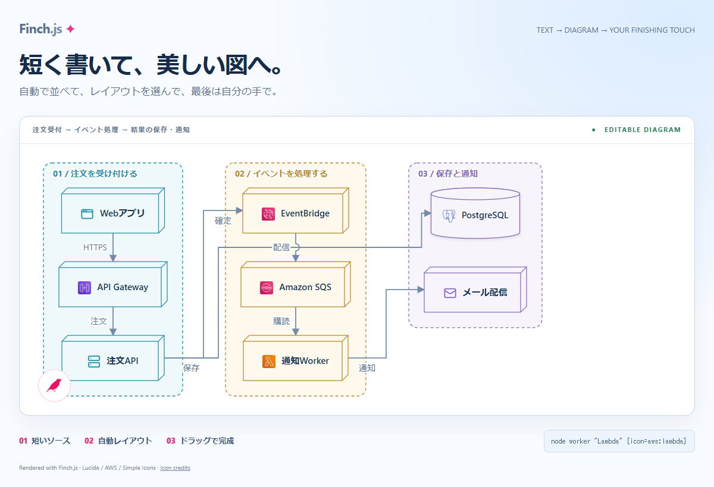
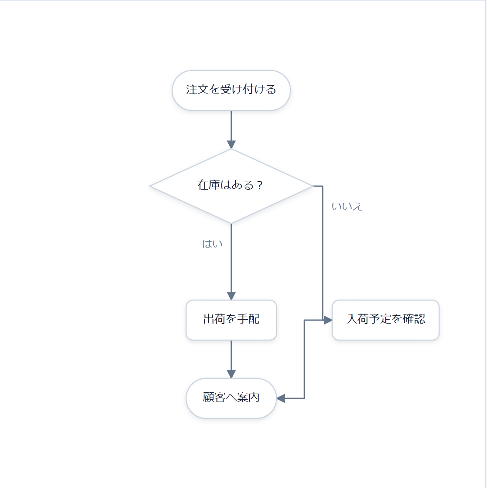
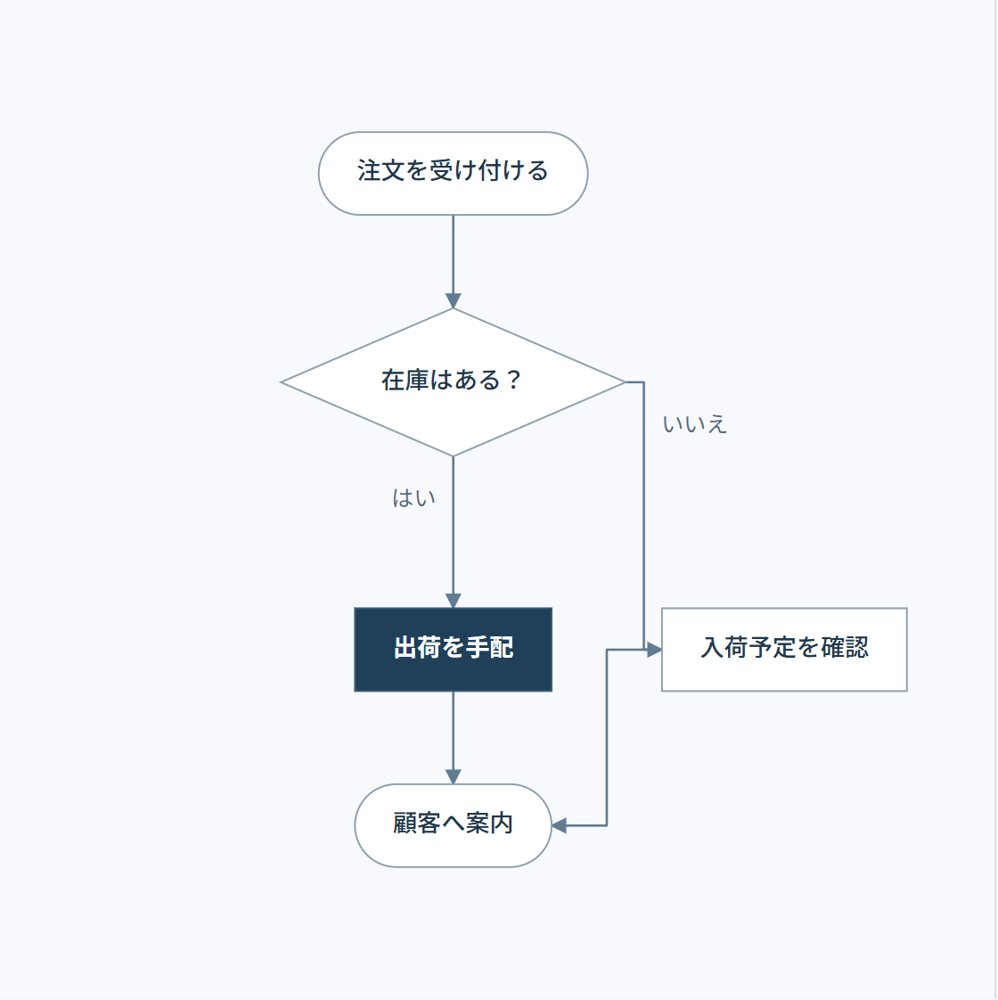
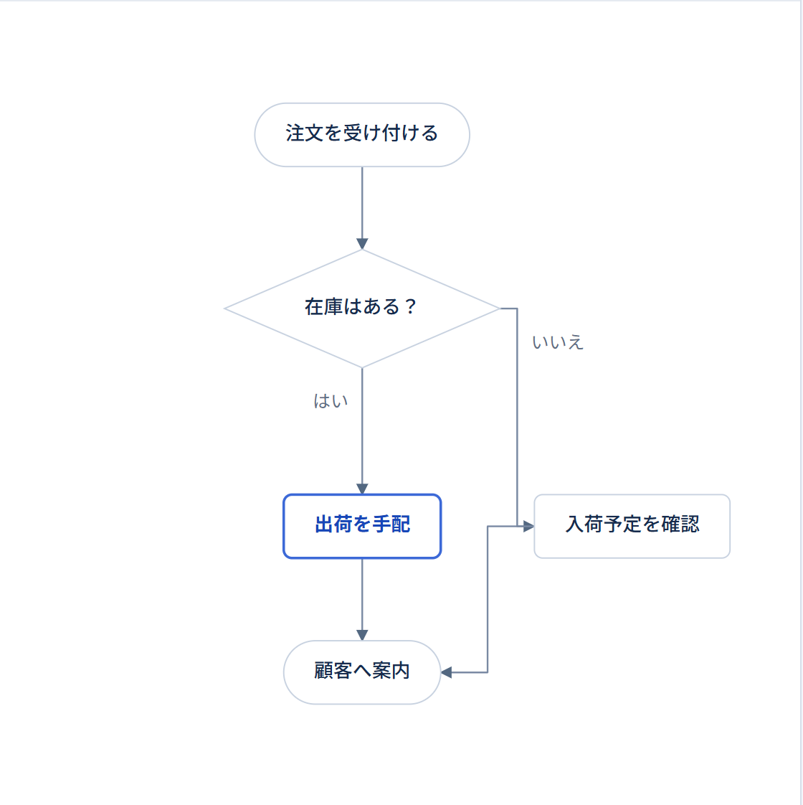
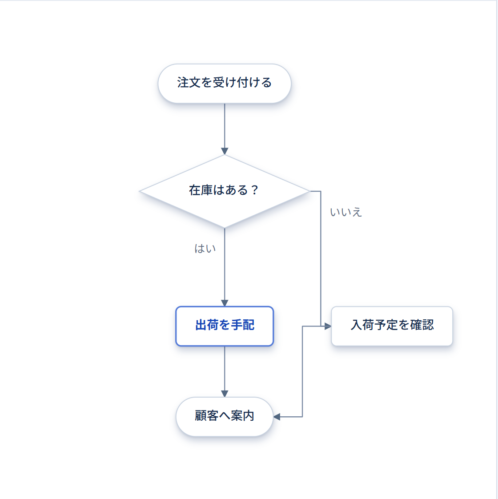
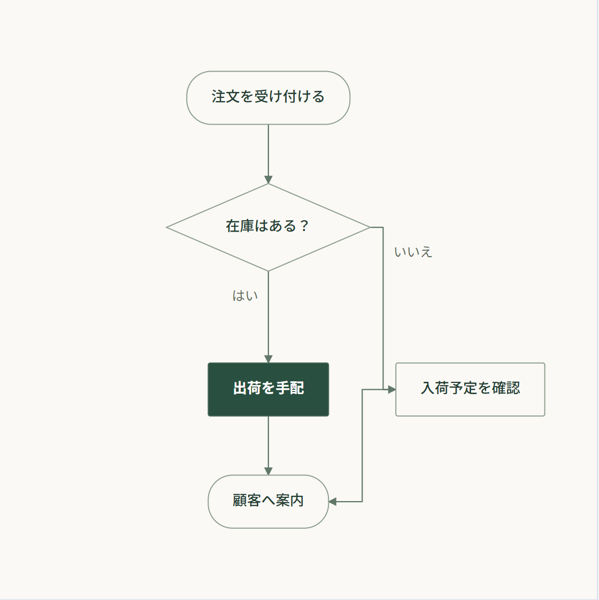

# Finch.js 

[English](./README.md)

# 🐦 美しい図を描こう

[](./examples/readme-hero.html?lang=ja)

注文受付・イベント処理・保存と通知を役割ごとに分けた例です。各まとまりを縦に並べ、必要な接続だけを示しています。リンク先の図は現在のリポジトリビルドで編集できます。

短いテキストから整った SVG 図を生成し、納得できるまでノードをドラッグして固定できます。ノード ID が同じなら、テキストを直したあとも人が決めた配置を引き継ぎます。

図版は現行リポジトリビルドで再生成しています。[生成元と更新記録](./docs/diagram-media.md)。

## 仕上げは思いどおりに

[](./examples/readme-demo.html)

[チュートリアル](./docs/tutorial_ja.md) · [作例を見る](./examples/README.md) · [npm パッケージ](https://www.npmjs.com/package/@hachiware-labs/finch-js)

## クイックスタート

リポジトリのルートで `npm ci` と `npm run build` を実行します。次の内容を `examples/diagram.html` に保存し、`python -m http.server 8000` を起動して `http://127.0.0.1:8000/examples/diagram.html` を開いてください。現在のチェックアウトを使います。

```html
<!doctype html>
<meta charset="UTF-8" />
<meta name="viewport" content="width=device-width, initial-scale=1" />
<style>
  body { margin: 0; }
  #diagram { min-height: 100vh; overflow: auto; padding: 24px; }
</style>

<main id="diagram" aria-label="注文処理のフローチャート"></main>

<script src="../dist/finch.global.js"></script>
<script>
  const orderFlowSource = `
@flowchart
start received "注文を受け付ける"
process validate "在庫を確認する"
decision available "在庫あり?"
process reserve "商品を確保する"
end confirmed "注文確定"
end backorder "入荷待ち"

received -> validate
validate -> available
available -> reserve: Yes
available -> backorder: No
reserve -> confirmed
  `.trim();

  Finch.render(orderFlowSource, { target: "#diagram" });
</script>
```

図の左下にあるピンクの鳥アイコンを押すと、Edit モードが開きます。ノードをドラッグしてからダブルクリックし、位置を固定します。ソース内の表示名を変えてみてください。図はその場で更新されますが、手で整えた配置は失われません。Save を押すまでは永続化されません。

ID と表示名は別です。`validate` は変えず、`"在庫を確認する"` だけを書き換えれば、保存した位置を引き継げます。

## Markdown に図と座標を保存する

図と座標をMarkdownの一つのコードフェンスに保存できます。[Markdown に図と座標を保存する](./docs/markdown_ja.md)で、`exportMarkdown()` と `Finch.renderMarkdown()` の使い方を確認できます。

## インストール

エディタ拡張や投稿サービスへの組み込みには、[プラグイン開発ガイド](./docs/plugin-development_ja.md)を参照してください。変更通知、保存コールバック、Markdownへの書き戻し、復元とフリーズの契約をまとめています。

```bash
npm install @hachiware-labs/finch-js
```

```js
import Finch, { createFinch } from "@hachiware-labs/finch-js";
```

script 要素から使う場合は、ブラウザーグローバル版を読み込みます。

```html
<script src="../dist/finch.global.js"></script>
```

## スタイル一覧

同じフローチャートを、スタイルを変えて描いています。

<table>
<tr><td align="center"><strong>Default</strong><br></td><td align="center"><strong>Precision</strong><br></td></tr>
<tr><td align="center"><strong>Business</strong><br></td><td align="center"><strong>Business-shadow</strong><br></td></tr>
<tr><td align="center"><strong>Editorial</strong><br></td><td></td></tr>
</table>

[スタイル比較ページ](./examples/style-study.html)では、図の種類や影の有無を切り替えて、SVGを保存できます。Business・Precision・Editorialは比較ページで定義したカスタムテーマの作例で、Business-shadowはBusinessの影あり版です。

## アイコン・役割色・自分の画像

`icon` と `tone` は、独自テーマを含む全テーマで共通に使えます。コンテナの `tone` は子孫へ継承され、子の指定で上書き、`tone=none` で解除できます。アイコンの絵柄は各ノードで指定し、継承しません。

```text
@deployment
container services "サービス" [tone=green] {
  node api "API" [icon=server]
  node auth "認証" [icon=shield-check tone=coral]
}
```

デフォルトはLucideです。AWS・Azure・Google Cloud・Kubernetes・Simple Iconsの追加パックを読み込めば、`icon=aws:application-auto-scaling` や `icon=simple:github` を指定できます。自分の画像は `image="./photo.png"`、丸型・角丸は `imageShape=circle`・`imageShape=rounded` で指定します。

これらは現在のリポジトリ版の機能です。`npm ci` と `npm run build` で作った本体を使ってください。[アイコンと画像の作例](./examples/icon-packs.html)、[チュートリアル](./docs/tutorial_ja.md#8-アイコン役割色画像を使う)、[パックの出典](./icon-packs/NOTICE.md)を参照してください。

## ダイアグラムの種類

| ディレクティブ | 用途 | 作例 |
| --- | --- | --- |
| `@deployment` | システムやインフラの構成 | [Deployment](./examples/deployment.html) |
| `@graph` | 汎用的な関係とグループ化したシステム | [Graph](./examples/graph.html) |
| `@sequence` | 時系列のやり取り | [Sequence](./examples/sequence.html) |
| `@flowchart` | 手順や分岐 | [Flowchart](./examples/flowchart.html) |
| `@state` | 状態と遷移 | [State](./examples/state.html) |
| `@er` | エンティティと関連 | [ER](./examples/er.html) |
| `@component` | ソフトウェアの境界とインターフェース | [Component](./examples/component.html) |
| `@slide` | プレゼンテーション用の図 | [Slide](./examples/slide.html) |
| `@class` | クラスと UML の関係 | [Class](./examples/class.html) |
| `@usecase` | アクターとシステムの目的 | [Use case](./examples/usecase.html) |
| `@activity` | アクションと制御フロー | [Activity](./examples/activity.html) |

## コーディングエージェントで図を作る

このリポジトリには、コーディングエージェントで使える [`finch` スキル](./.agents/skills/finch/SKILL.md)が含まれています。エージェントに次のように頼めます。

```text
Finch スキルを使って、注文審査フローのアクティビティ図を HTML に描いて。
```

Codex はこのチェックアウトからスキルを自動検出し、明示的に呼び出す場合は `$finch` を使えます。ほかのワークスペースや対応エージェントへインストールする場合は、次を実行します。

```bash
npx skills add hachiware-labs/finch-js --skill finch
```

インストーラー上で対象エージェントを選べます。`--agent claude-code cursor` のように直接指定することもできます。すべてのリポジトリで使う場合は `--global` を追加し、インストール直後にスキルが表示されなければエージェントを再起動してください。

## 詳しく知る

- [チュートリアル](./docs/tutorial_ja.md)：図の生成、配置、更新、保存、組み込みを順に試します。
- [リファレンス](./docs/reference_ja.md)：記法、編集操作、保存、イベント、画像出力、インスタンス API を確認できます。
- [発展例](./examples/README.md)：対応するすべての図法を、編集できる完成例で確認できます。
- [Finch.js の拡張](./docs/extensions_ja.md)：独自の図、Shape、Layout、Theme を追加します。
- [スライドパターン](./docs/slide-patterns_ja.md)：KPI、データストーリー、ロードマップ、比較、顧客の声を再利用できる形で組み立てます。

## 開発

```bash
npm ci
npm run check
```

作例をローカルで見るには `python -m http.server 8000` を実行し、`http://127.0.0.1:8000/examples/` を開いてください。

Finch.js は [MIT License](./LICENSE) で公開しています。

<details>
<summary>画像クレジット</summary>

- ヘッダーのシルエットは、Julien Renoult による[グリーンムシクイフィンチの写真](https://www.inaturalist.org/observations/9398069)（[CC BY 4.0](https://creativecommons.org/licenses/by/4.0/)）を加工したものです。
- フッターのシルエットは、Andrew Katsis による[<i>Green warbler-finch on Santa Cruz Island</i>](https://commons.wikimedia.org/wiki/File:Green_warbler-finch_on_Santa_Cruz_Island.jpg)（[CC BY 4.0](https://creativecommons.org/licenses/by/4.0/)）を加工したものです。

どちらも背景を除去し、鳥をシルエット化して単色化・再配置しています。
</details>

<p align="right">
  
</p>


## 簡潔なUML拡張

注釈・制約は `note Order "説明"` / `constraint Item "quantity > 0"`、接続への注釈は `note api->stock "冪等にする"` と書けます。シーケンスは `alt` 内の `else`、`par` 内の `and` で区画を分けられます。

状態の入れ子は `state id { ... }`、並行領域は `region id { ... }`、アクティビティの担当は `lane id { ... }`、クラスの所属は `package id { ... }` で表します。IDは図全体で一意です。状態図は標準で縦流れになり、平坦な図は `@state direction=LR` で横流れにできます。

現在のリポジトリビルドで利用できます。[編集できるサンプル](./examples/uml-concise.html)と[記法・制限](./docs/uml-concise_ja.md)を参照してください。クラス・オブジェクトの名前空間に対応しています。制約式の実行検証とレーンの入れ子は未対応です。


## 実用UMLの追加記法

シーケンスは同期 `->`、非同期 `->>`、応答 `-->` を描き分けます。実行区間は `activate` / `deactivate`、寿命は `create` / `destroy` で指定できます。状態内は `entry` / `exit` / `do` / `internal`、役割は `stereotype id "service"`、クラスメンバーは `static` / `abstract` で表します。

アクティビティは `while id "条件" { ... }` / `repeat id "条件" { ... }` で処理を順につなぎ、戻り線を生成します。出口は `id.done`。クラスの関連端名は `[fromRole=owner toRole=items]`、関連クラスは `association Link A->B` です。

現在のリポジトリビルドで利用できます。[編集できるサンプル](./examples/uml-practical.html)と[詳しい記法・制限](./docs/uml-practical_ja.md)を参照してください。分岐ごとの寿命、構造化制御フロー、関連クラスの接続については、[現在の対応差分](docs/plantuml-parity_ja.md)を参照してください。


## 状態図の意味と構造チェック

`terminate`（×）と`final`（二重丸）を区別し、擬似状態の種別を保持します。`[kind=local]` でlocal遷移を指定できます。`parseState(source).diagnostics` で構造診断を取得し、`@state validation=strict` で不正な構造をエラーにできます。[対応範囲と記法](docs/state-semantics_ja.md)。

並行領域と履歴の検証、`entryPoint` / `exitPoint`、`machine` 定義と `[submachine=名前]` による再利用にも対応しています。


[UML extensions and examples](examples/uml-complete.html) · [Syntax and validation](docs/uml-complete_ja.md)


タイミング図は状態・区間・バイナリ信号・アナログ値・クロックを共通時間軸で表示します。[編集できるサンプル](examples/timing.html)で確認できます。


[共通部品・include・繰り返し・関数・検証のリファレンス](docs/preprocessing_ja.md)

[注釈とシーケンスのページ出力](docs/annotations_ja.md)


## UMLサンプルの巡回

[UMLサンプルガイド](examples/uml-guide.html)から、基本図と発展例を図種別に見比べられます。シーケンスの分岐と寿命、状態の履歴・並行領域・継承、アクティビティの中断、クラスの関連クラス・テンプレートまで扱います。図内の編集ボタンからソースを変更できます。構造診断と振る舞いの実行検証は区別しています。
