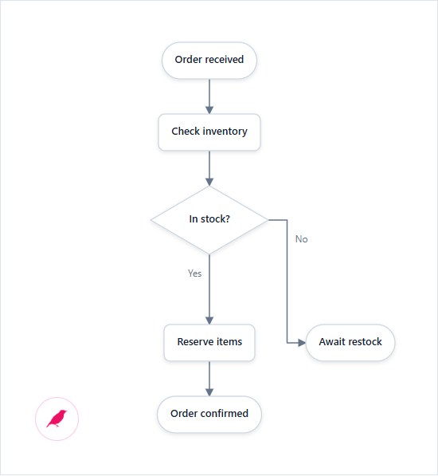

# Finch.js tutorial

[日本語](./tutorial_ja.md) · [Back to README](../README.md)

Allow about 15 minutes: draw, arrange, edit, save, and choose a type. You need a text editor, a browser, and an internet connection for the CDN script.

## 1. Render the first diagram

Save this as `order-flow.html` in UTF-8 and open it in your browser. It uses published version 0.5.1; no installation or build is needed. An internet connection is required.

```html
<!doctype html>
<html lang="en">
  <head>
    <meta charset="UTF-8" />
    <meta name="viewport" content="width=device-width, initial-scale=1" />
    <title>Order flow</title>
    <style>
      body { margin: 0; background: #f8fafc; }
      #diagram { min-height: 100vh; overflow: auto; padding: 24px; }
    </style>
  </head>
  <body>
    <main id="diagram" aria-label="Order fulfillment flowchart"></main>

    <script src="https://cdn.jsdelivr.net/npm/@hachiware-labs/finch-js@0.5.1/dist/finch.global.js"></script>
    <script>
      const orderFlowSource = `
@flowchart
start received "Order received"
process validate "Check inventory"
decision available "In stock?"
process reserve "Reserve items"
end confirmed "Order confirmed"
end backorder "Await restock"

received -> validate
validate -> available
available -> reserve: Yes
available -> backorder: No
reserve -> confirmed
      `.trim();

      const diagram = Finch.render(orderFlowSource, { target: "#diagram" });
    </script>
  </body>
</html>
```

Expected result: a top-to-bottom order flow and a small pink bird icon in the diagram's lower-left.

Next, make the generated layout yours.

[](../examples/tutorial-order-en.html)

The image and linked example use the repository build, so visual details may differ. Stop when the normal path and its exception are easy to follow. Symmetry and zero crossings are not requirements.

## 2. Arrange and pin

Press the pink bird icon. The editor opens below the diagram and enables layout editing.

Try these actions in order:

1. Drag `Await restock` farther from the successful path.
2. Double-click it to pin the position. A pin marker appears.
3. Drag another node but leave it unpinned.
4. Press **Auto layout**.

The pinned node stays where you put it. Unpinned nodes are free to move when Finch.js recalculates the layout. **Undo** returns to the previous layout, while **Reset** discards all manual positions and pins.

Next, change the meaning without starting the layout over.

## 3. Change the source and keep the layout

In the editor's Source field, change this line:

First drag `Check inventory` to a new position, then keep the ID `validate` unchanged when you edit its label.

```text
process validate "Check inventory and allocation"
```

The diagram updates after a short pause. The text changes, but `validate` stays in the same hand-tuned position because its ID did not change.

Now add a new side effect. Add this declaration after `reserve`:

```text
process audit "Record allocation"
```

Add this edge after `reserve -> confirmed`:

```text
reserve --> audit: Async
```

The new `audit` node enters automatic layout while existing manual positions remain associated with their IDs. If the new meaning needs more room, drag the new node or run **Auto layout** to integrate it. This is why IDs should describe stable identity and labels should carry wording that may change.

Next, decide where the layout should live.

## 4. Save the source and layout

In **0.5.1**, used here, **Save** stores source and layout in browser local storage. Reload the same file in the same browser and check that your changed label and pinned position return. It does not rewrite the HTML file.

If your browser restricts local-file storage, run `python -m http.server 8000` in the file’s folder and open `http://localhost:8000/order-flow.html` to try saving and reloading (requires Python).

In the repository build, Save saves editable HTML instead. See [HTML saving (Japanese)](saving_ja.md), [Markdown saving (Japanese)](markdown_ja.md), or [application integration](embedding.md) when you need them.

Next, choose a diagram from the question you need to answer.

## 5. Choose the diagram type

| If the reader needs to understand… | Start with | Example |
| --- | --- | --- |
| where software runs | `@deployment` | [Production services](../examples/deployment.html) |
| how otherwise untyped things relate | `@graph` | [Commerce system map](../examples/graph.html) |
| what happens in time order | `@sequence` | [Checkout calls](../examples/sequence.html) |
| how a process branches | `@flowchart` | [Review flow](../examples/flowchart.html) |
| how something changes state | `@state` | [Job lifecycle](../examples/state.html) |
| how data relates | `@er` | [Order data](../examples/er.html) |
| where software responsibilities end | `@component` | [Application boundaries](../examples/component.html) |
| how classes relate | `@class` | [Order domain](../examples/class.html) |
| what users want from a system | `@usecase` | [System goals](../examples/usecase.html) |
| how UML actions coordinate | `@activity` | [Order activity](../examples/activity.html) |
| one presentation takeaway | `@slide` | [KPI summary](../examples/slide-patterns.html) |
| how signals change over time | `@timing` | [Timing](../examples/timing.html) |

Open a nearby example and edit its source instead of learning the entire vocabulary first. The [reference](./reference.md) lists the common declarations and links to every complete example.


Examples and reference pages target the repository build; timing and additional UML syntax are not in 0.5.1. See [local setup](../README.md#development).

## Next steps

- [Coding agents](agents.md)
- [Generate a diagram from a prompt](generating.md)
- [Application integration](embedding.md)
- [Icons, colors, and images](icons.md)
- [UML example guide](../examples/uml-guide.html)
