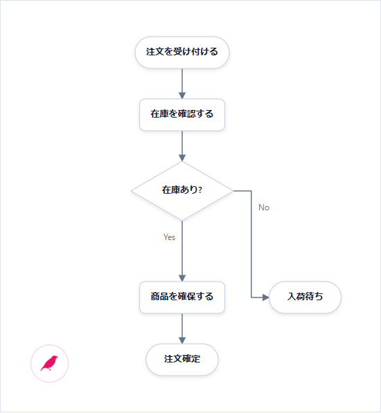

# Finch.js チュートリアル

[English](./tutorial.md) · [README に戻る](../README_ja.md)

このチュートリアルでは、実務的な図を生成し、手で配置を整え、その配置を失わずにソースを変更し、用途に合った方法で保存・組み込みできるところまで進みます。

## 1. 最初の図を表示する

リポジトリのルートで `npm ci` と `npm run build` を実行します。次のページを `examples/order-flow.html` に保存し、`python -m http.server 8000` を起動して `http://127.0.0.1:8000/examples/order-flow.html` を開いてください。コードと画像は現在のチェックアウトを使います。

```html
<!doctype html>
<html lang="ja">
  <head>
    <meta charset="UTF-8" />
    <meta name="viewport" content="width=device-width, initial-scale=1" />
    <title>注文処理フロー</title>
    <style>
      body { margin: 0; background: #f8fafc; }
      #diagram { min-height: 100vh; overflow: auto; padding: 24px; }
    </style>
  </head>
  <body>
    <main id="diagram" aria-label="注文処理のフローチャート"></main>

    <script src="../dist/finch.global.js"></script>
    <script>
      const orderFlowSource = `
@flowchart
start received "注文を受け付ける"
process validate "在庫を確認する"
decision available "在庫あり?"
process reserve "商品を確保する"
end confirmed "注文確定"
end backorder "入荷待ち"

received -> validate
validate -> available
available -> reserve: Yes
available -> backorder: No
reserve -> confirmed
      `.trim();

      const diagram = Finch.render(orderFlowSource, { target: "#diagram" });
    </script>
  </body>
</html>
```

縦に進む注文処理と、図の左下に小さなピンクの鳥アイコンが表示されれば成功です。

次は、自動生成された配置を自分の図へ仕上げます。

[](../examples/tutorial-order-ja.html)

上の画像と編集用ページは、掲載コードと同じリポジトリビルドで描画しています。正常経路と例外の関係が読めれば、対称性や交差ゼロを目指して整え続ける必要はありません。

## 2. ドラッグして固定する

ピンクの鳥アイコンを押してください。図の下にエディターが開き、レイアウトを編集できるようになります。

次の順に操作します。

1. `入荷待ち` を正常系の経路から少し離れた場所へドラッグします。
2. そのノードをダブルクリックして固定します。Pin の印が表示されます。
3. ほかのノードも動かしますが、こちらは固定しません。
4. **Auto layout** を押します。

固定したノードは手で決めた位置に残り、固定していないノードだけが再配置の対象になります。**Undo** は直前の配置へ戻し、**Reset** は手動位置と固定をすべて破棄します。

次は、配置をやり直さずに図の意味を変更します。

## 3. 配置を保ったままソースを変える

エディターの Source 欄で、次の行を書き換えます。

```text
process validate "在庫と引当可能数を確認する"
```

少し待つと図が更新されます。表示文言は変わりますが、`validate` という ID は同じなので、手で整えた位置は変わりません。

続いて新しい副作用を追加します。`reserve` の宣言の次に、次の行を加えてください。

```text
process audit "引当結果を記録する"
```

`reserve -> confirmed` の次に、次の線を加えます。

```text
reserve --> audit: 非同期
```

新しい `audit` は自動配置へ入り、既存 ID に対応する手動位置は引き継がれます。意味が増えて余白が必要になったら、新しいノードをドラッグするか **Auto layout** で全体へなじませます。長く使う同一性は ID に、あとから変わりうる表現は表示名に持たせるのがポイントです。

次は、ソースと配置をどこへ保存するか決めます。

## 4. ソースと配置を保存する

### 標準エディターの Save

Finch エディターの **Save** を押すと、ページ内の図のソースと全ノードの配置を含むHTMLを保存します。初回は現在のHTML名を候補にして保存先を選び、同じページを開いている間はファイルハンドルを再利用します。「名前を付けて保存」で保存先を変更できます。API非対応時はHTMLをダウンロードします。保存したHTMLを開いて復元を確認してください。Edit ON/OFFでは保存しません。詳しくは[保存とコールバック](./saving_ja.md)を参照してください。

ホストアプリケーションへ保存する場合は、保存アダプターを差し替えます。`load` と `save` は同期関数でも非同期関数でも構いません。

```js
Finch.render(source, {
  target: "#diagram",
  editor: {
    storage: {
      load: (key) => workspace.readDiagramState(key),
      save: (key, value) => workspace.writeDiagramState(key, value),
    },
  },
});
```

### アプリ独自の Save

アプリ側で UI を用意する場合は、明示的に配置を保存します。

```js
saveButton.addEventListener("click", () => {
  localStorage.setItem("order-flow-layout", diagram.exportLayout());
});

const saved = localStorage.getItem("order-flow-layout");
if (saved) diagram.importLayout(saved);
```

`finch:layoutchange` の `changedNodeIds` が空でないときだけ、未保存の配置変更として扱います。永続化するのは利用者が Save を選んだときです。

### 静的 HTML に配置を埋め込む

図の近くに JSON の script 要素を置きます。

```html
<script type="application/json" id="order-layout" data-finch-layout>
  {"version":1,"diagram":"flowchart","editable":false,"nodes":{}}
</script>
```

描画時にその内容を渡します。

```js
const overlay = document.querySelector("#order-layout").textContent;
const diagram = Finch.render(orderFlowSource, {
  target: "#diagram",
  overlay,
  editor: false,
});
```

ページを仕上げる間は `diagram.saveLayout("#order-layout")` を呼ぶと、現在の overlay をその script 要素へ書き込めます。生成された JSON を HTML にコピーしてコミットしてください。静的な文書でも、意味を表すソースと人が決めた座標を分けて管理できます。

次は、答えたい問いから図法を選びます。

## 5. 図法を選ぶ

| 読み手が知りたいこと | 最初に試す図法 | 作例 |
| --- | --- | --- |
| ソフトウェアがどこで動くか | `@deployment` | [本番サービス](../examples/deployment.html) |
| 型を決めずに要素同士の関係を見たい | `@graph` | [コマースシステムマップ](../examples/graph.html) |
| 何がどの順番で起きるか | `@sequence` | [購入処理の呼び出し](../examples/sequence.html) |
| 手順がどう分岐するか | `@flowchart` | [審査フロー](../examples/flowchart.html) |
| 状態がどう変わるか | `@state` | [ジョブのライフサイクル](../examples/state.html) |
| データがどう関係するか | `@er` | [注文データ](../examples/er.html) |
| ソフトウェアの責任境界がどこか | `@component` | [アプリケーション境界](../examples/component.html) |
| クラスがどう関係するか | `@class` | [注文ドメイン](../examples/class.html) |
| 利用者がシステムで何をしたいか | `@usecase` | [システムの目的](../examples/usecase.html) |
| UML のアクションがどう協調するか | `@activity` | [注文アクティビティ](../examples/activity.html) |
| プレゼンで何を一つ伝えるか | `@slide` | [KPI サマリー](../examples/slide-patterns.html) |

最初から全語彙を覚えず、目的に近い作例を開いてソースを変更してください。[リファレンス](./reference_ja.md)には、よく使う宣言とすべての完成例へのリンクがあります。

次は、すでに持っている情報から最初のドラフトを生成します。

## 6. コーディングエージェントと使う

このリポジトリには、Finch のソースと描画コードを一つの HTML にまとめる共通スキルが含まれています。コーディングエージェントに次のように頼めます。

```text
Finch スキルを使って、この注文審査仕様からアクティビティ図を HTML に作って。
ID は安定させ、正確な配置はあとで人が整えられるようにして。
```

生成された事実関係を確認し、ページを開き、人の判断が必要な数か所だけをドラッグして固定します。要件が変わったら、図を作り直さずにテキストを更新します。

Codex はリポジトリ内のスキルを自動検出し、明示的な呼び出しには `$finch` を使えます。ほかのワークスペースや対応エージェントへインストールする場合は、次を実行します。

```bash
npx skills add hachiware-labs/finch-js --skill finch
```

インストーラー上で対象エージェントを選ぶか、`--agent claude-code cursor` のように直接指定します。呼び出し方法はエージェントごとに異なりますが、スキルの指示と生成する Finch.js HTML は共通です。

次は、標準エディターとは異なる UI が必要なときに Finch.js をアプリへ接続します。

## 7. アプリへ組み込む

メニューのない図にするには標準エディターを無効にします。編集を許可するタイミングをアプリ側で決める場合は、閲覧モードから始めます。

```js
const host = document.querySelector("#diagram");
const diagram = Finch.render(source, {
  target: host,
  editor: false,
  editable: false,
});

editButton.addEventListener("click", () => {
  diagram.setEditable(!diagram.editable);
});

host.addEventListener("finch:layoutchange", (event) => {
  const { overlay, changedNodeIds } = event.detail;
  if (changedNodeIds.length) markUnsaved(overlay);
});

sourceEditor.addEventListener("input", () => {
  diagram.update(sourceEditor.value);
});
```

独自の Edit 切り替えには `finch:editchange`、ズーム表示には `finch:zoomchange` を使って同期できます。画像を明示的に保存する場合は `downloadSvg()` または `downloadPng()` を呼びます。

## 8. アイコン・役割色・画像を使う

この節では現在のリポジトリ版を使います。第1節と同じビルドです。リポジトリのルートで `npm ci`、`npm run build`、`python -m http.server 8000` を実行してください。次のHTMLを `examples/` 内に保存し、HTTPで開きます。画像の `image-avatar.svg` はそのフォルダに用意されています。別の場所に保存する場合は、スクリプトと画像の相対パスを変更します。

```html
<!doctype html>
<meta charset="UTF-8" />
<div id="diagram"></div>
<script src="../dist/finch.global.js"></script>
<script src="../icon-packs/aws.js"></script>
<script src="../icon-packs/simple.js"></script>
<script>
const source = `
@deployment
container services "Services" [tone=green] {
  node api "API" [icon=server]
  node auth "Auth" [icon=shield-check tone=coral]
}
node scale "Auto Scaling" [icon=aws:application-auto-scaling]
node repo "GitHub" [icon=simple:github]
node owner "Owner" [image="./image-avatar.svg" imageShape=circle]
api -> scale
owner -> repo
`.trim();
const diagram = Finch.render(source, { target: '#diagram', theme: 'prism' });
</script>
```

### 全テーマ共通の属性

- `icon=server` は同梱のLucideアイコンです。定義はテーマから独立して、Finchエンジンが管理します。
- `tone` は指定のある最も近い祖先から継承します。子の指定で上書き、`tone=none` でその配下も含め基本色へ戻します。
- 共通色は `cyan`・`coral`・`green`・`amber`・`violet` です。テーマの配色定義は任意で、未定義の色には共通の役割色とテーマの基本の塗りを使います。
- 属性を変えずに `theme` を `default`・`midnight`・独自テーマオブジェクトへ切り替えられます。Business・Precision・Editorialは独自テーマの作例で、組み込みのテーマ名ではありません。

### 必要なパックを読み込む

| `icon-packs/` 内のファイル | 指定例 |
| --- | --- |
| `aws.js` | `icon=aws:application-auto-scaling` |
| `azure.js` | `icon=azure:virtual-machine` |
| `gcp.js` | `icon=gcp:compute-engine` |
| `k8s.js` | `icon=k8s:pod` |
| `simple.js` | `icon=simple:github` |

各スクリプトは `finch.global.js` の後に読み込みます。パックは画像埋め込み済みで、表示時の通信は不要です。本体とは別ファイルなので、必要なものだけを選べます。名前と別名は[カタログ](../icon-packs/catalog.json)、配布元・版は[出典](../icon-packs/NOTICE.md)を参照してください。クラウド系は第三者コレクションの固定版で、各社の最新画像を保証するものではありません。ブランド画像は元の色を保ち、Lucideの線色は継承後のtoneに従います。

ES Modulesでは、このリポジトリから作ったパッケージの `@hachiware-labs/finch-js/icon-packs/aws` から `aws` をimportし、`Finch.registerIconPack('aws', aws)` で登録します。独自画像は `Finch.registerIcon('company:logo', { src: './logo.svg' })` と登録することもできます。

### 自分の画像を指定する

`image="./photo.png"` の相対パスはHTMLの場所が基準です。画像を直接返すHTTP(S) URLや画像のdata URLも使えます。PNG・JPEG・GIF・WebP・SVGに対応し、`icon` と併記した場合は `image` を優先します。

`imageShape` を省略すると縦横比を保って枠内に収めます。`circle` は丸型、`rounded` は角丸の正方形に切り抜きます。SVG自体に余白や縦横比の設定がある場合も含め、アバターには正方形の素材を使うと形を整えやすくなります。

現在の対応Shapeはrectangle・rounded・server・database・uml-artifact・uml-device・uml-executionです。コンテナや複数区画のクラス・エンティティには画像を追加しません。未知のアイコン名は無視します。

### 画像を含めて書き出す

```js
try {
  await diagram.downloadSvg('services.svg');
  // PNGの場合: await diagram.downloadPng('services.png');
} catch (error) {
  console.error('画像の書き出しに失敗しました:', error);
}
```

SVG・PNG保存では参照画像を取得し、埋め込んでから書き出します。外部画像には配信元のCORS許可が必要です。file://の画像取得は拒否される場合があるため、ローカル画像はHTTPで開いてください。失敗時は画像を欠落させたまま保存せず、エラーを返します。`toSvgString()` は参照を残し、`await toEmbeddedSvgString()` は画像を埋め込んだSVG文字列を返します。

編集用HTMLの保存は元の画像参照を保持します。HTMLを渡すときは、参照画像・パック・ランタイムも一緒に配布してください。自動で画像を含む単一HTMLにする機能ではありません。

[全パックと画像の完成例](../examples/icon-packs.html)で試せます。

これで、テキストから生成し、人が配置を判断し、ソースを育て、その二種類の情報を別々に保存する一連の流れを扱えるようになりました。

次は[リファレンス](./reference_ja.md)を確認するか、[発展例](../examples/README.md)を触ってみてください。独自の記法、Shape、Layout、Theme が必要になったら[Finch.js の拡張](./extensions_ja.md)へ進みます。


## 簡潔なUML拡張

注釈・制約は `note Order "説明"` / `constraint Item "quantity > 0"`、接続への注釈は `note api->stock "冪等にする"` と書けます。シーケンスは `alt` 内の `else`、`par` 内の `and` で区画を分けられます。

状態の入れ子は `state id { ... }`、並行領域は `region id { ... }`、アクティビティの担当は `lane id { ... }`、クラスの所属は `package id { ... }` で表します。IDは図全体で一意です。状態図は標準で縦流れになり、平坦な図は `@state direction=LR` で横流れにできます。

現在のリポジトリビルドで利用できます。[編集できるサンプル](../examples/uml-concise.html)と[記法・制限](../docs/uml-concise_ja.md)を参照してください。クラス・オブジェクトの名前空間に対応しています。制約式の実行検証とレーンの入れ子は未対応です。


## 実用UMLの追加記法

シーケンスは同期 `->`、非同期 `->>`、応答 `-->` を描き分けます。実行区間は `activate` / `deactivate`、寿命は `create` / `destroy` で指定できます。状態内は `entry` / `exit` / `do` / `internal`、役割は `stereotype id "service"`、クラスメンバーは `static` / `abstract` で表します。

アクティビティは `while id "条件" { ... }` / `repeat id "条件" { ... }` で処理を順につなぎ、戻り線を生成します。出口は `id.done`。クラスの関連端名は `[fromRole=owner toRole=items]`、関連クラスは `association Link A->B` です。

現在のリポジトリビルドで利用できます。[編集できるサンプル](../examples/uml-practical.html)と[詳しい記法・制限](../docs/uml-practical_ja.md)を参照してください。分岐ごとの寿命、ループ内の分岐・break/continue・任意の接続線、関連クラスからの関係線に対応しました。[追加記法](uml-complete_ja.md)も参照してください。


## 状態図の意味と構造チェック

`terminate`（×）と`final`（二重丸）を区別し、擬似状態の種別を保持します。`[kind=local]` でlocal遷移を指定できます。`parseState(source).diagnostics` で構造診断を取得し、`@state validation=strict` で不正な構造をエラーにできます。[対応範囲と記法](state-semantics_ja.md)。

並行領域と履歴の検証、`entryPoint` / `exitPoint`、`machine` 定義と `[submachine=名前]` による再利用にも対応しています。


タイミング図は状態・区間・バイナリ信号・アナログ値・クロックを共通時間軸で表示します。[編集できるサンプル](../examples/timing.html)で確認できます。


[共通部品・include・繰り返し・関数・検証のリファレンス](preprocessing_ja.md)

[注釈とシーケンスのページ出力](annotations_ja.md)


## UMLサンプルの巡回

[UMLサンプルガイド](../examples/uml-guide.html)から、基本図と発展例を図種別に見比べられます。シーケンスの分岐と寿命、状態の履歴・並行領域・継承、アクティビティの中断、クラスの関連クラス・テンプレートまで扱います。図内の編集ボタンからソースを変更できます。構造診断と振る舞いの実行検証は区別しています。
